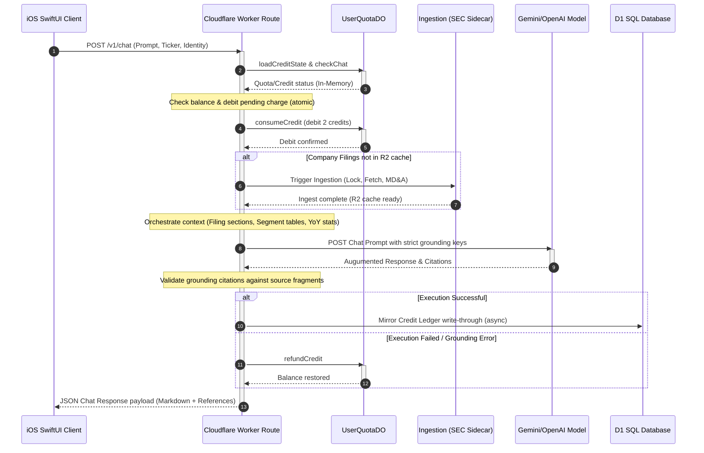
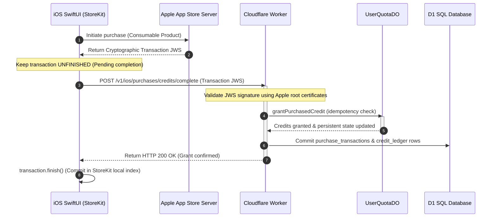
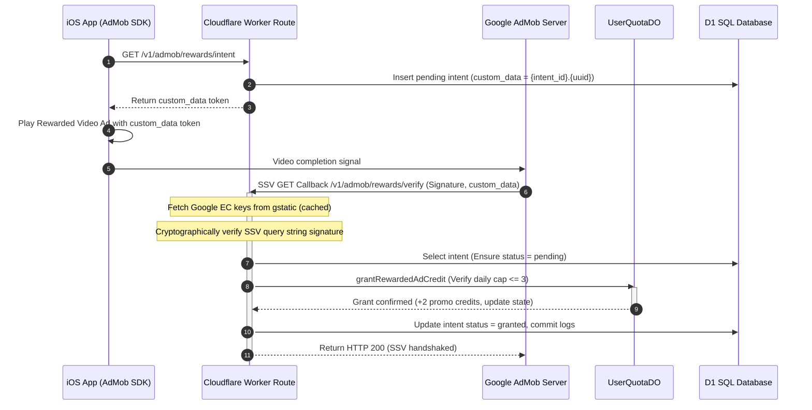
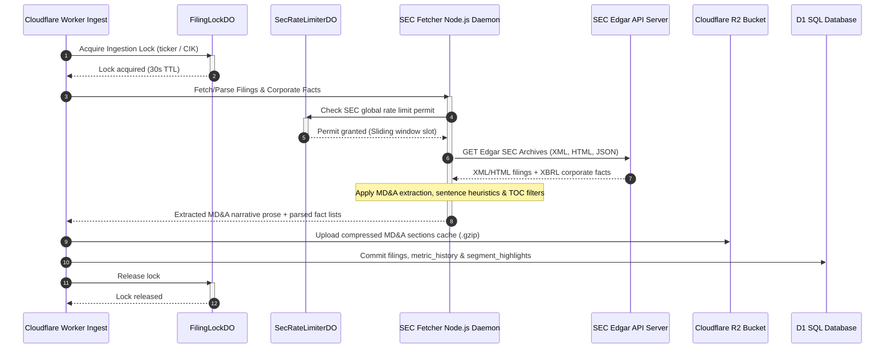

# Kabuyomi System Audit & Architecture Mapping

**Author**: Independent Technical Auditor (acting as a Third-Party Agency)

**Date**: May 22, 2026

**Status**: COMPLETED AUDIT

---

## 1. Executive Summary

This report presents a thorough, file-by-file technical audit of the Kabuyomi corporate disclosure chat platform. The system consists of an iOS SwiftUI application, a Cloudflare Workers backend, in-memory transactional Durable Objects, Cloudflare D1 SQLite database, Cloudflare R2 bucket, and a Node.js SEC Edgar ingestion sidecar container. The system exhibits robust engineering practices, utilizing memory-isolated transactional ledgers, self-healing queues, StoreKit 2 incomplete-transaction recovery, cryptographic Server-Side Verification for ad verification, and advanced boundary-marker heuristics for section extraction.

---

## 2. Core Multi-Component Flows

### A. Chat Generation & Context Synthesis Pipeline (`/v1/chat`)
The `/v1/chat` endpoint coordinates the preflight account validation, corporate document ingestion, context prompt synthesis, LLM model routing, citation grounding, and credit accounting. Below is the step-by-step lifecycle of a chat request:

1. **Preflight Check & Atomic Debit**: Before dispatching prompts to LLM endpoints, the worker requests identity resolutions, authenticating StoreKit entitlements or persistent device Keychain keys. It submits a block-concurrent query to `UserQuotaDO` to debit required credits. If the balance is insufficient, it aborts early with HTTP 402.
2. **Context Compilation**: The worker coordinates database retrieval from the D1 `metric_history` and `segment_highlights` tables, composes markdown financial overview charts, pulls compressed corporate narrative paragraphs from R2, and compiles a unified contextual prompt pack.
3. **LLM Driver & Fault-Tolerance**: Routes prompt payloads to Google Gemini or OpenAI endpoints based on latency benchmarks and client complexity tiers. If the LLM throws server errors, the worker engages fallback models sequentially.
4. **Audit and Write-Through**: When success is validated, the worker writes through the balance status and ledger updates to the SQLite D1 database. If D1 network timeouts occur, the worker catches the failure and enqueues a background repair job in `credit_audit_repair_queue`, ensuring transactional operations are unaffected.

### B. Billing & StoreKit 2 Handshake (Consumable & Subscriptions)
Direct consumable credit packs purchase requires backend validation of JWS receipt arrays prior to on-device completion. This prevents local transaction injections. Below is the transactional mapping:

1. **Cryptographic Validation**: The backend receives the raw Apple Transaction JWS string and validates the digital signature against Apple Root certificates. It decodes properties like `transactionId`, `originalTransactionId`, and `productId`.
2. **Idempotency Safeguard**: The `UserQuotaDO` checks its stored purchase transaction keys to ensure the transaction has not been processed previously, preventing duplicate credit injection.
3. **Recovery Loop**: If network boundaries are severed before the client finishes the transaction, the iOS app queries Apple's `Transaction.unfinished` API on next startup and re-submits the validation handshake, guaranteeing purchase delivery.

### C. AdMob SSV Cryptographic Callback & Credit Grant
Promotional credits are granted through complete rewarded ad watching. This process is validated using Google's Elliptic Curve Server-Side Verification (SSV) callback signatures. Below is the callback handshake mapping:

1. **Intent Lock**: The application queries `/v1/admob/rewards/intent` to log a pending intent and receive a signed metadata query string token. This token is passed to Google's server during playback.
2. **Signature Verification**: On callback, the worker downloads Google's public ECDSA keys from `gstatic.com` (cached locally in Memory) and cryptographically validates the signature query parameter against the payload.
3. **Daily Cap Enforcements**: The `UserQuotaDO` tracks daily reward counts in-memory. If a user tries to trigger more than 3 rewards per day, the DO rejects the operation, returning `cap_reached` to block bot injections.

### D. SEC Ingestion & MD&A Processing Flow
Ingesting corporate documents requires distributed coordination to prevent parallel downloads, complying with the strict SEC rate limit guidelines (<10 req/s globally). Below is the ingestion pipeline map:

1. **Filing Locks**: Ingest operations use `FilingLockDO` to obtain an atomic processing lease. If an ingestion for the same ticker is in progress, secondary requests wait on lock lease notifications, avoiding duplicative SEC calls.
2. **SEC Edgar Compliance**: To prevent SEC IP blocks, the global `SecRateLimiterDO` serves as a single central sliding window. It dynamically sleeps worker request threads, capping global traffic to the SEC Edgar servers to 10 requests per second.
3. **Extraction & Section Segmentation Heuristics**: The Node.js sidecar parses raw XBRL files and compiles metrics. For textual files, it isolates Management's Discussion and Analysis (MD&A) sections using Lookahead Prose heuristics and Table of Contents filters, stripping leading TOC index anchors and reducing text to fit within token budgets.

---

## 3. Database Architecture (D1 SQL Schema)
Below is a structural profile of the nine database migrations defining the SQLite D1 databases schemas, indices, and constraints. Heavy payloads (such as processed narrative texts) are stored in R2 buckets, keeping D1 lightweight and highly performant.

### Database Tables Profile
| Table Name | Primary Key | Foreign Keys / Constraints | Purpose |
| :--- | :--- | :--- | :--- |
| `filings` | `filing_key` | None | Stores indexed corporate filing records (ticker, form_type, filed_at). |
| `metric_history` | `(filing_key, logical_name, source_id)` | `filing_key` $\rightarrow$ `filings(filing_key)` | Records corporate financial indices (logical_name, value, YoY delta). |
| `segment_highlights` | `(filing_key, dimension, label)` | `filing_key` $\rightarrow$ `filings(filing_key)` | Stores textual breakdowns of corporate segment highlights (label, summary). |
| `latest_filing_aliases` | `(extractor_version, ticker)` | None | Caches filing references, keeping KV out of hot request paths. |
| `search_form_type_cache` | `ticker` | None | Stores cached forms (10-K, 10-Q) with expiration limits. |
| `credit_ledger` | `id` | `operation_id` UNIQUE | Logs accounting transactions (deltas, balances, reference_types). |
| `monthly_grants` | `id` | `operation_id` UNIQUE | Tracks monthly quotas resets and period assignments. |
| `purchase_transactions` | `id` | `transaction_id` UNIQUE | Logs consumable credit purchases validated by StoreKit handshakes. |
| `filing_prep_jobs` | `job_id` | None | Tracks async watchlist preparation states. |
| `admob_reward_intents` | `id` | `custom_data` UNIQUE | Tracks video ad reward sessions. |
| `admob_reward_transactions` | `transaction_id` | `operation_id` UNIQUE | Records validated cryptographic ad transaction callbacks. |
| `credit_audit_repair_queue` | `id` | None | The self-healing buffer queue for writing failed balance mirrors. |

---

## 4. Comprehensive File-by-File Technical Audit
This section maps every single source file in the Kabuyomi codebase. Files are grouped logically by module and folder structure. Each file lists its size (bytes), lines of code, declared classes/structs, and detailed purpose.

### Cloudflare D1 SQL Schema & Database Migration Steps (`workers/d1/migrations/`)

---

#### 📄 `workers/d1/migrations/0001_history.sql`
- **Size**: 1475 bytes | **Lines**: 50 lines
- **Purpose & Operational Profile**: An SQL database migration file. It structures tables, column configurations, foreign keys, unique indices, and triggers to construct schema snapshots in SQLite D1.

#### 📄 `workers/d1/migrations/0002_filing_metadata.sql`
- **Size**: 663 bytes | **Lines**: 22 lines
- **Purpose & Operational Profile**: An SQL database migration file. It structures tables, column configurations, foreign keys, unique indices, and triggers to construct schema snapshots in SQLite D1.

#### 📄 `workers/d1/migrations/0003_credit_accounting.sql`
- **Size**: 1324 bytes | **Lines**: 46 lines
- **Purpose & Operational Profile**: An SQL database migration file. It structures tables, column configurations, foreign keys, unique indices, and triggers to construct schema snapshots in SQLite D1.

#### 📄 `workers/d1/migrations/0004_monthly_grant_plan_index.sql`
- **Size**: 130 bytes | **Lines**: 2 lines
- **Purpose & Operational Profile**: An SQL database migration file. It structures tables, column configurations, foreign keys, unique indices, and triggers to construct schema snapshots in SQLite D1.

#### 📄 `workers/d1/migrations/0005_purchase_transactions_user_index.sql`
- **Size**: 118 bytes | **Lines**: 2 lines
- **Purpose & Operational Profile**: An SQL database migration file. It structures tables, column configurations, foreign keys, unique indices, and triggers to construct schema snapshots in SQLite D1.

#### 📄 `workers/d1/migrations/0006_filing_prep_jobs.sql`
- **Size**: 704 bytes | **Lines**: 22 lines
- **Purpose & Operational Profile**: An SQL database migration file. It structures tables, column configurations, foreign keys, unique indices, and triggers to construct schema snapshots in SQLite D1.

#### 📄 `workers/d1/migrations/0007_monthly_grants_drop_user_period_index.sql`
- **Size**: 203 bytes | **Lines**: 3 lines
- **Purpose & Operational Profile**: An SQL database migration file. It structures tables, column configurations, foreign keys, unique indices, and triggers to construct schema snapshots in SQLite D1.

#### 📄 `workers/d1/migrations/0008_admob_rewarded_credits.sql`
- **Size**: 999 bytes | **Lines**: 33 lines
- **Purpose & Operational Profile**: An SQL database migration file. It structures tables, column configurations, foreign keys, unique indices, and triggers to construct schema snapshots in SQLite D1.

#### 📄 `workers/d1/migrations/0009_credit_audit_repair_queue.sql`
- **Size**: 802 bytes | **Lines**: 24 lines
- **Purpose & Operational Profile**: An SQL database migration file. It structures tables, column configurations, foreign keys, unique indices, and triggers to construct schema snapshots in SQLite D1.

### Cloudflare Durable Objects Stateful In-Memory Engines (`workers/src/durable/`)

---

#### 📄 `workers/src/durable/entitlement.ts`
- **Size**: 2504 bytes | **Lines**: 64 lines
- **Declared Classes/Structs/Interfaces**: `EntitlementDO`
- **Ecosystem Dependencies**: `../lib/contracts`, `../lib/entitlements`, `../lib/errors`, `../lib/request`, `@cloudflare/workers-types`
- **Purpose & Operational Profile**: The App Store Server notification subscription state manager. It maintains active Apple entitlement states and binds them to device keys. It processes validation handshakes and logs active plans.

#### 📄 `workers/src/durable/filing-lock.ts`
- **Size**: 3629 bytes | **Lines**: 111 lines
- **Declared Classes/Structs/Interfaces**: `FilingLockDO`
- **Key Methods/Functions**: `json()`, `readToken()`, `sleep()`
- **Ecosystem Dependencies**: `@cloudflare/workers-types`
- **Purpose & Operational Profile**: The distributed locking DO. It prevents simultaneous parallel ingestion/parsing of SEC filings for the same corporate entity (ticker / CIK). It maintains a persistent in-memory lock table with lease TTLs (30 seconds), lease renewals, and auto-eviction. Workers query this lock before initiating ingestion, preventing race conditions on Edgar downloads.

#### 📄 `workers/src/durable/sec-rate-limiter.ts`
- **Size**: 1267 bytes | **Lines**: 40 lines
- **Declared Classes/Structs/Interfaces**: `SecRateLimiterDO`
- **Key Methods/Functions**: `sleep()`
- **Ecosystem Dependencies**: `@cloudflare/workers-types`
- **Purpose & Operational Profile**: A global, sliding-window rate limiter ensuring the Edgar constraint of <10 requests/second is met globally. It routes all requests to Edgar through a centralized queue, sleeping worker request threads on throttle to prevent SEC IP blocks.

#### 📄 `workers/src/durable/user-quota.ts`
- **Size**: 42300 bytes | **Lines**: 1292 lines
- **Declared Classes/Structs/Interfaces**: `ChatRefundRecord`, `CreditOperationRecord`, `CreditStateRecord`, `MonthlyGrantRecord`, `PurchaseGrantRecord`, `QuotaRecord`, `RewardedAdDailyCapRecord`, `SavedTickerRecord`, `UserQuotaDO`
- **Key Methods/Functions**: `buildChatRefundKey()`, `buildCreditOperation()`, `buildCreditOperationKey()`, `buildCreditPeriod()`, `buildDailyKey()`, `buildMonthlyDowngradeNoClawbackOperationId()`, `buildMonthlyGrantKey()`, `buildMonthlyGrantOperationId()`, `buildPurchaseTransactionKey()`, `buildRewardedAdDailyCapKey()`, `buildTickerGroup()`, `creditUsagePayload()`, and 10 other methods
- **Ecosystem Dependencies**: `../lib/billing-catalog`, `../lib/contracts`, `../lib/errors`, `../lib/request`, `@cloudflare/workers-types`
- **Purpose & Operational Profile**: The transactionally isolated, in-memory credit and daily chat limit state machine. Running as a Cloudflare Durable Object, it represents the single source of truth for user balances, active subscriptions, daily video ad reward limits, and tracked stock limits. It uses `this.state.blockConcurrencyWhile` to process actions in-memory with strict serializability, avoiding race conditions on simultaneous requests. It handles actions like credit consumption, credit refunds, credit pack additions, promotional grants, and watchlist ticker limits, and persists its structures to transactional DO storage.

### Cloudflare Workers Core & Model Clients (`workers/src/clients/`)

---

#### 📄 `workers/src/clients/chat-model.ts`
- **Size**: 164 bytes | **Lines**: 2 lines
- **Ecosystem Dependencies**: `./llm/provider`, `./llm/types`
- **Purpose & Operational Profile**: An HTTP client service module that maps endpoint routes, handles fetch arrays, decodes payloads, and manages retries on network failures.

#### 📄 `workers/src/clients/gemini.ts`
- **Size**: 11455 bytes | **Lines**: 329 lines
- **Key Methods/Functions**: `attachChatDecisionMeta()`, `attachLlmUsage()`, `didRecoverWithLocalFallback()`, `generateChatAnswer()`, `generateQuoteTranslation()`, `generateSummary()`, `isGeminiTimeout()`, `logSchemaMismatch()`, `maybeRepairChatSchema()`, `usagePayload()`
- **Ecosystem Dependencies**: `../env`, `../lib/logging`, `./gemini/chat-quality`, `./gemini/fallback`, `./gemini/fallback-summary`, `./gemini/normalize`, `./gemini/prompts`, `./gemini/request`
- **Purpose & Operational Profile**: Google Gemini model integration service. It compiles parameters, structures system prompts, implements fallback routines, and formats text responses for client display.

#### 📄 `workers/src/clients/gemini/chat-quality.ts`
- **Size**: 14369 bytes | **Lines**: 260 lines
- **Key Methods/Functions**: `classifyLowQualityChatAnswer()`, `firstPatternIndex()`, `hasRevenueDiscussionContext()`, `hasRevenueDriverContext()`, `isRevenueDriverContextChunk()`, `polishChatAnswerForQuestion()`, `shouldRecoverLowQualityChatAnswer()`
- **Ecosystem Dependencies**: `./types`
- **Purpose & Operational Profile**: Google Gemini model integration service. It compiles parameters, structures system prompts, implements fallback routines, and formats text responses for client display.

#### 📄 `workers/src/clients/gemini/fallback-known-business.ts`
- **Size**: 2171 bytes | **Lines**: 53 lines
- **Key Methods/Functions**: `selectKnownBusinessSourceId()`, `summarizeKnownCompanyBusiness()`
- **Ecosystem Dependencies**: `../../env`, `./types`
- **Purpose & Operational Profile**: Google Gemini model integration service. It compiles parameters, structures system prompts, implements fallback routines, and formats text responses for client display.

#### 📄 `workers/src/clients/gemini/fallback-question.ts`
- **Size**: 4179 bytes | **Lines**: 86 lines
- **Key Methods/Functions**: `analyzeQuestion()`, `wantsNarrativeDepth()`
- **Purpose & Operational Profile**: Google Gemini model integration service. It compiles parameters, structures system prompts, implements fallback routines, and formats text responses for client display.

#### 📄 `workers/src/clients/gemini/fallback-summary.ts`
- **Size**: 3673 bytes | **Lines**: 96 lines
- **Key Methods/Functions**: `buildSummaryMetricLine()`, `buildSummaryNarrativeLine()`, `findMetricSourceIdFromSummaryInput()`, `localSummaryFallback()`, `normalizeSummarySourceLabel()`
- **Ecosystem Dependencies**: `../../env`, `../../lib/metrics`, `./types`
- **Purpose & Operational Profile**: Google Gemini model integration service. It compiles parameters, structures system prompts, implements fallback routines, and formats text responses for client display.

#### 📄 `workers/src/clients/gemini/fallback.ts`
- **Size**: 78714 bytes | **Lines**: 1766 lines
- **Key Methods/Functions**: `add()`, `addMetric()`, `buildClosestContextFallbackAnswer()`, `buildClosestContextLead()`, `buildClosestContextLimitation()`, `buildDurabilityConclusion()`, `buildDurabilityFallbackAnswer()`, `buildDurabilityLead()`, `buildInvestmentViewFallbackAnswer()`, `buildMetricFallbackAnswer()`, `buildMetricNextStep()`, `buildMetricObservation()`, and 56 other methods
- **Ecosystem Dependencies**: `../../env`, `../../lib/metrics`, `./fallback-known-business`, `./fallback-question`, `./types`
- **Purpose & Operational Profile**: Google Gemini model integration service. It compiles parameters, structures system prompts, implements fallback routines, and formats text responses for client display.

#### 📄 `workers/src/clients/gemini/normalize.ts`
- **Size**: 4768 bytes | **Lines**: 173 lines
- **Key Methods/Functions**: `firstString()`, `isRecord()`, `normalizeChatResponse()`, `normalizeQuoteTranslationResponse()`, `normalizeSourceIds()`, `normalizeSummaryLines()`, `normalizeSummaryResponse()`, `parseJsonishText()`, `polishJapaneseText()`, `stripAnswerFormattingArtifacts()`, `stripEnglishParentheticals()`
- **Ecosystem Dependencies**: `../../env`, `../../lib/contracts`, `./types`
- **Purpose & Operational Profile**: Google Gemini model integration service. It compiles parameters, structures system prompts, implements fallback routines, and formats text responses for client display.

#### 📄 `workers/src/clients/gemini/prompts.ts`
- **Size**: 18825 bytes | **Lines**: 308 lines
- **Key Methods/Functions**: `answerFormatInstruction()`, `buildChatPrompt()`, `buildChatPromptTemplateVariables()`, `buildQuoteTranslationPrompt()`, `buildSummaryPrompt()`, `chatResponseJsonSchema()`, `quoteTranslationResponseJsonSchema()`, `retryInstruction()`, `summaryResponseJsonSchema()`
- **Ecosystem Dependencies**: `./types`
- **Purpose & Operational Profile**: Google Gemini model integration service. It compiles parameters, structures system prompts, implements fallback routines, and formats text responses for client display.

#### 📄 `workers/src/clients/gemini/request.ts`
- **Size**: 12404 bytes | **Lines**: 389 lines
- **Declared Classes/Structs/Interfaces**: `GeminiApiPayload`, `GeminiApiRequestError`, `GeminiInvocationResult`
- **Key Methods/Functions**: `buildGeminiApiRequestError()`, `classifyGeminiError()`, `classifyGeminiHttpError()`, `extractGeminiErrorCode()`, `invokeGemini()`, `isRetryableGeminiApiError()`, `normalizeTokenCount()`, `normalizeUsageMetadata()`, `resolveGeminiModel()`, `resolveGeminiTimeoutMs()`, `resolveGeminiTranslationFallbackModel()`, `resolveGeminiTranslationModel()`, and 2 other methods
- **Ecosystem Dependencies**: `../../env`, `../../lib/logging`, `./normalize`, `./prompts`, `./types`
- **Purpose & Operational Profile**: Google Gemini model integration service. It compiles parameters, structures system prompts, implements fallback routines, and formats text responses for client display.

#### 📄 `workers/src/clients/gemini/types.ts`
- **Size**: 6678 bytes | **Lines**: 204 lines
- **Declared Classes/Structs/Interfaces**: `ChatLanguageGuardDiagnostics`, `ChatPromptInput`, `ChatQualityControlDiagnostics`, `ChatRetryDiagnostics`, `ChatRetryInstruction`, `GeminiApiErrorDiagnostics`, `GeminiChatAnswer`, `GeminiInvocationUsage`, `QuoteTranslationPromptInput`, `SummaryPromptInput`
- **Ecosystem Dependencies**: `../../env`, `../../lib/chat/context-pack`, `../../lib/chat/intent`
- **Purpose & Operational Profile**: Google Gemini model integration service. It compiles parameters, structures system prompts, implements fallback routines, and formats text responses for client display.

#### 📄 `workers/src/clients/llm/errors.ts`
- **Size**: 1501 bytes | **Lines**: 45 lines
- **Key Methods/Functions**: `classifyProviderHttpError()`, `extractErrorCode()`
- **Ecosystem Dependencies**: `./types`
- **Purpose & Operational Profile**: An HTTP client service module that maps endpoint routes, handles fetch arrays, decodes payloads, and manages retries on network failures.

#### 📄 `workers/src/clients/llm/provider.ts`
- **Size**: 8552 bytes | **Lines**: 240 lines
- **Key Methods/Functions**: `buildOpenAIQuoteTranslationPrompt()`, `containsInvestmentAdvice()`, `containsJapanese()`, `exactTermsToPreserve()`, `generateModelChatAnswer()`, `generateModelQuoteTranslation()`, `generateOpenAIQuoteTranslation()`, `guardQuoteTranslation()`, `isPreservableProperNoun()`, `isQuoteTranslationAvailable()`, `leakedOrdinaryEnglishTerm()`, `repairResidualEnglishTerms()`, and 1 other methods
- **Ecosystem Dependencies**: `../../env`, `../gemini`, `../gemini/normalize`, `../gemini/prompts`, `../gemini/types`, `./providers/gemini-legacy`, `./providers/openai`, `./types`
- **Purpose & Operational Profile**: An HTTP client service module that maps endpoint routes, handles fetch arrays, decodes payloads, and manages retries on network failures.

#### 📄 `workers/src/clients/llm/providers/gemini-legacy/index.ts`
- **Size**: 1018 bytes | **Lines**: 29 lines
- **Key Methods/Functions**: `generateDisabledProviderFallback()`, `generateGeminiLegacyChatAnswer()`
- **Ecosystem Dependencies**: `../../../../env`, `../../../gemini`, `../../../gemini/fallback`, `../../../gemini/request`, `../../../gemini/types`
- **Purpose & Operational Profile**: Google Gemini model integration service. It compiles parameters, structures system prompts, implements fallback routines, and formats text responses for client display.

#### 📄 `workers/src/clients/llm/providers/gemini-legacy/types.ts`
- **Size**: 178 bytes | **Lines**: 8 lines
- **Ecosystem Dependencies**: `../../../gemini/types`
- **Purpose & Operational Profile**: Google Gemini model integration service. It compiles parameters, structures system prompts, implements fallback routines, and formats text responses for client display.

#### 📄 `workers/src/clients/llm/providers/openai/client.ts`
- **Size**: 7851 bytes | **Lines**: 201 lines
- **Key Methods/Functions**: `attachChatDecisionMeta()`, `attachLlmUsage()`, `attachOpenAIErrorDiagnostics()`, `attachProviderMeta()`, `didRecoverWithLocalFallback()`, `generateOpenAIChatAnswer()`, `openAIModelConfigDiagnostics()`
- **Ecosystem Dependencies**: `../../../../env`, `../../../../lib/logging`, `../../../gemini/chat-quality`, `../../../gemini/fallback`, `../../../gemini/normalize`, `../../../gemini/prompts`, `../../../gemini/types`, `./errors`
- **Purpose & Operational Profile**: OpenAI model API connector. It formats request arrays, maps completions, handles billing logs, and validates response schemas.

#### 📄 `workers/src/clients/llm/providers/openai/errors.ts`
- **Size**: 2860 bytes | **Lines**: 85 lines
- **Declared Classes/Structs/Interfaces**: `OpenAIApiRequestError`
- **Key Methods/Functions**: `buildOpenAIApiRequestError()`, `classifyOpenAIError()`, `classifyOpenAIHttpError()`, `isRetryableOpenAIApiError()`, `sampleErrorMessage()`
- **Ecosystem Dependencies**: `../../errors`, `./types`
- **Purpose & Operational Profile**: OpenAI model API connector. It formats request arrays, maps completions, handles billing logs, and validates response schemas.

#### 📄 `workers/src/clients/llm/providers/openai/index.ts`
- **Size**: 633 bytes | **Lines**: 21 lines
- **Ecosystem Dependencies**: `./client`, `./errors`, `./request`, `./response`
- **Purpose & Operational Profile**: OpenAI model API connector. It formats request arrays, maps completions, handles billing logs, and validates response schemas.

#### 📄 `workers/src/clients/llm/providers/openai/request.ts`
- **Size**: 15060 bytes | **Lines**: 493 lines
- **Key Methods/Functions**: `buildOpenAIChatRequest()`, `buildOpenAIQuoteTranslationRequest()`, `buildOpenAIResponsesPromptRequest()`, `invokeOpenAIChat()`, `invokeOpenAIDashboardPrompt()`, `invokeOpenAIQuoteTranslation()`, `isOpenAIReasoningEffort()`, `logInvalidReasoningEffortIfNeeded()`, `openAIChatResponseJsonSchema()`, `requestedOpenAIChatModel()`, `resolveOpenAIChatModel()`, `resolveOpenAIMaxCompletionTokens()`, and 4 other methods
- **Ecosystem Dependencies**: `../../../../env`, `../../../../lib/logging`, `../../../gemini/prompts`, `./errors`, `./response`, `./types`
- **Purpose & Operational Profile**: OpenAI model API connector. It formats request arrays, maps completions, handles billing logs, and validates response schemas.

#### 📄 `workers/src/clients/llm/providers/openai/response.ts`
- **Size**: 1961 bytes | **Lines**: 77 lines
- **Key Methods/Functions**: `extractOpenAIMessageContent()`, `extractOpenAIResponseText()`, `parseOpenAIChatCompletionPayload()`, `parseOpenAIResponsesPayload()`
- **Ecosystem Dependencies**: `../../../gemini/normalize`, `./types`
- **Purpose & Operational Profile**: OpenAI model API connector. It formats request arrays, maps completions, handles billing logs, and validates response schemas.

#### 📄 `workers/src/clients/llm/providers/openai/types.ts`
- **Size**: 1530 bytes | **Lines**: 57 lines
- **Declared Classes/Structs/Interfaces**: `OpenAIApiErrorDiagnostics`, `OpenAIChatCompletionPayload`, `OpenAIChatInvocationResult`, `OpenAIResponsesPayload`
- **Ecosystem Dependencies**: `../../../gemini/types`
- **Purpose & Operational Profile**: OpenAI model API connector. It formats request arrays, maps completions, handles billing logs, and validates response schemas.

#### 📄 `workers/src/clients/llm/types.ts`
- **Size**: 653 bytes | **Lines**: 25 lines
- **Ecosystem Dependencies**: `../gemini/types`
- **Purpose & Operational Profile**: An HTTP client service module that maps endpoint routes, handles fetch arrays, decodes payloads, and manages retries on network failures.

#### 📄 `workers/src/clients/openai/index.ts`
- **Size**: 276 bytes | **Lines**: 11 lines
- **Ecosystem Dependencies**: `../llm/providers/openai`
- **Purpose & Operational Profile**: OpenAI model API connector. It formats request arrays, maps completions, handles billing logs, and validates response schemas.

#### 📄 `workers/src/clients/openai/request.ts`
- **Size**: 151 bytes | **Lines**: 6 lines
- **Ecosystem Dependencies**: `../llm/providers/openai/request`
- **Purpose & Operational Profile**: OpenAI model API connector. It formats request arrays, maps completions, handles billing logs, and validates response schemas.

#### 📄 `workers/src/clients/sec-fetcher.ts`
- **Size**: 11068 bytes | **Lines**: 364 lines
- **Declared Classes/Structs/Interfaces**: `FetchSubmissionsOptions`, `FilingAssetsFetcherResponse`, `MetricsFetcherResponse`, `PreparedFilingFetcherResponse`
- **Key Methods/Functions**: `fetchFilingAssetsFromFetcher()`, `fetchFilingHtmlFromFetcher()`, `fetchFromCloudflareInternalSecFetcher()`, `fetchMetricsFromFetcher()`, `fetchPreparedFilingFromFetcher()`, `fetchSubmissionsFromFetcher()`, `fetchTickerSnapshotFromFetcher()`, `fetcherRequest()`, `isTestEnvironment()`, `parsePositiveInt()`, `waitForSecRateLimit()`
- **Ecosystem Dependencies**: `../env`, `../lib/errors`, `../lib/logging`, `../lib/sec-fetcher-service`, `./sec`
- **Purpose & Operational Profile**: An HTTP client service module that maps endpoint routes, handles fetch arrays, decodes payloads, and manages retries on network failures.

#### 📄 `workers/src/clients/sec-ticker-alias.ts`
- **Size**: 1942 bytes | **Lines**: 61 lines
- **Key Methods/Functions**: `matchesClassTickerAlias()`, `matchesCompactTickerAlias()`, `normalizeClassTickerAlias()`, `normalizeCompactTicker()`, `normalizeSeriesBaseTickerFallback()`, `normalizeTickerInput()`, `parseTickerAliasInput()`, `resolveBaseTickerFallback()`
- **Ecosystem Dependencies**: `../env`
- **Purpose & Operational Profile**: An HTTP client service module that maps endpoint routes, handles fetch arrays, decodes payloads, and manages retries on network failures.

#### 📄 `workers/src/clients/sec.ts`
- **Size**: 27477 bytes | **Lines**: 940 lines
- **Declared Classes/Structs/Interfaces**: `CompanyFactsResponse`, `ConceptFact`, `ConceptResponse`, `FilingHtmlResponse`, `PreparedFilingResponse`, `SubmissionRecent`, `SubmissionResponse`, `TickerSearchContext`, `TickerSearchIndexEntry`, `TickerSnapshot`, `TickerSnapshotEnvelope`, `TickerSnapshotMemoryCache`
- **Key Methods/Functions**: `accessionWithoutDashes()`, `allSupportedFilings()`, `buildFilingKey()`, `buildMetricSnapshotsFromFetcherPayload()`, `buildPrimaryDocumentUrl()`, `buildTickerSearchContext()`, `buildTickerSearchIndex()`, `buildTickerSnapshot()`, `cacheTickerSnapshot()`, `compareTickerSearchEntry()`, `durationScore()`, `enrichTickerSearchResults()`, and 30 other methods
- **Ecosystem Dependencies**: `../env`, `../lib/logging`, `../lib/search-form-type-cache`, `./sec-fetcher`, `./sec-ticker-alias`
- **Purpose & Operational Profile**: An HTTP client service module that maps endpoint routes, handles fetch arrays, decodes payloads, and manages retries on network failures.

#### 📄 `workers/src/clients/web-search.ts`
- **Size**: 16501 bytes | **Lines**: 547 lines
- **Declared Classes/Structs/Interfaces**: `WebSupplementRecord`
- **Key Methods/Functions**: `analyzeWebIntent()`, `buildSearchQueries()`, `cleanHtmlFragment()`, `decodeHtmlEntities()`, `enrichResult()`, `extractMetaDescription()`, `extractTitle()`, `fetchText()`, `findTrustedWebSupplement()`, `inferPublisher()`, `isTrustedWebResult()`, `isUsableTrustedResult()`, and 4 other methods
- **Ecosystem Dependencies**: `../env`, `../lib/logging`
- **Purpose & Operational Profile**: An HTTP client service module that maps endpoint routes, handles fetch arrays, decodes payloads, and manages retries on network failures.

### Cloudflare Workers General Utility Libraries & Drivers (`workers/src/lib/`)

---

#### 📄 `workers/src/lib/admob-ssv.ts`
- **Size**: 3834 bytes | **Lines**: 126 lines
- **Declared Classes/Structs/Interfaces**: `AdMobPublicKey`, `AdMobPublicKeysResponse`
- **Key Methods/Functions**: `base64Decode()`, `base64UrlDecode()`, `loadAdMobPublicKey()`, `normalizeEcdsaSignature()`, `readDerInteger()`, `toArrayBuffer()`, `toFixedInteger()`, `verifyAdMobSsvCallback()`
- **Ecosystem Dependencies**: `../env`
- **Purpose & Operational Profile**: The Google AdMob Server-Side Verification (SSV) signature validator. It decodes reward callbacks, fetches Google's public elliptic-curve (EC) keys from `gstatic.com/admob/ssv/keys-v2.json`, and cryptographically verifies signatures against query strings using ECDSA SHA256.

#### 📄 `workers/src/lib/apple-store-server.ts`
- **Size**: 21082 bytes | **Lines**: 613 lines
- **Declared Classes/Structs/Interfaces**: `AppStoreServerTokenDebugInfo`, `AppStoreTransactionInfoResponse`, `AppleErrorDetails`, `AppleVerificationAttempt`, `CreditPurchaseVerificationRequest`, `ParsedTransactionPayload`, `SubscriptionVerificationRequest`
- **Key Methods/Functions**: `base64UrlDecode()`, `base64UrlEncodeBytes()`, `base64UrlEncodeJSON()`, `buildAppStoreServerToken()`, `buildAppStoreServerTokenWithDebug()`, `buildAppleAuthLog()`, `derEcdsaSignatureToJose()`, `ensureSubscriptionIsActive()`, `ensureTransactionMatches()`, `fetchSignedTransactionInfo()`, `isAppleTransactionNotFound()`, `normalizeAppleDateToIso()`, and 16 other methods
- **Ecosystem Dependencies**: `../env`, `./billing-catalog`, `./errors`, `./logging`
- **Purpose & Operational Profile**: The Apple App Store Server API driver. It validates JWS receipts, queries historical subscriptions, decodes transaction structures, and maps Apple's product catalogs (consumables and subscriptions) to local system quotas.

#### 📄 `workers/src/lib/billing-catalog.ts`
- **Size**: 4796 bytes | **Lines**: 156 lines
- **Declared Classes/Structs/Interfaces**: `ConsumableProductConfig`, `PlanLimits`, `SubscriptionProductConfig`
- **Key Methods/Functions**: `isCreditPackProductId()`, `isSubscriptionProductId()`, `resolveCreditPackCredits()`, `resolveCreditPackProduct()`, `resolveMonthlyCreditLimit()`, `resolvePlanFromBilling()`, `resolvePlanLimits()`, `resolveSubscriptionMonthlyCredits()`, `resolveSubscriptionPlan()`, `resolveSubscriptionProduct()`
- **Ecosystem Dependencies**: `./remote-config`
- **Purpose & Operational Profile**: An accounting and credit balance management module. It tracks balances, audits mutations, and writes through updates to databases.

#### 📄 `workers/src/lib/company-response.ts`
- **Size**: 1290 bytes | **Lines**: 46 lines
- **Key Methods/Functions**: `serializeCompanyResponse()`
- **Ecosystem Dependencies**: `../env`, `./history-store`
- **Purpose & Operational Profile**: A helper service or data model module that structures schemas, defines configurations, or exposes mathematical and utility methods used throughout the application.

#### 📄 `workers/src/lib/company/usecase.ts`
- **Size**: 5415 bytes | **Lines**: 190 lines
- **Declared Classes/Structs/Interfaces**: `CompanyUsecaseInput`, `RunCompanyUsecaseInput`
- **Key Methods/Functions**: `buildRetryableCompanyBody()`, `isRetryableCompanyLoadError()`, `loadCompanyUsecase()`, `loadLatestCompanyFiling()`, `refreshCompanyUsecase()`, `runCompanyUsecase()`
- **Ecosystem Dependencies**: `../../clients/sec`, `../../env`, `../company-response`, `../errors`, `../filings/cache`, `../filings/latest`, `../logging`, `../quota`
- **Purpose & Operational Profile**: A core business logic use-case action driver. It coordinates transactional state flows, database checks, and external services to fulfill the specific operation.

#### 📄 `workers/src/lib/contracts.ts`
- **Size**: 7261 bytes | **Lines**: 186 lines
- **Purpose & Operational Profile**: A helper service or data model module that structures schemas, defines configurations, or exposes mathematical and utility methods used throughout the application.

#### 📄 `workers/src/lib/credit-audit-repair.ts`
- **Size**: 10490 bytes | **Lines**: 373 lines
- **Declared Classes/Structs/Interfaces**: `AdMobRewardTransactionRepairPayload`, `CreditAuditRepairQueueRow`, `CreditAuditRepairResult`, `CreditLedgerRepairPayload`, `EnqueueCreditAuditRepairOptions`, `MonthlyGrantRepairPayload`, `PurchaseTransactionMarkRepairPayload`
- **Key Methods/Functions**: `applyCreditAuditRepair()`, `buildRepairId()`, `enqueueCreditAuditRepair()`, `markRepairRow()`, `processCreditAuditRepairQueue()`, `repairAdMobRewardTransaction()`, `repairCreditLedger()`, `repairMonthlyGrant()`, `repairPurchaseTransactionMark()`, `truncateError()`
- **Ecosystem Dependencies**: `../env`, `./logging`
- **Purpose & Operational Profile**: The fault-tolerance and self-healing subsystem. It runs as an asynchronous worker, retrieving entries from the `credit_audit_repair_queue` D1 table and resolving ledger mismatches in SQLite matching Durable Object state changes.

#### 📄 `workers/src/lib/credit-operation.ts`
- **Size**: 1837 bytes | **Lines**: 82 lines
- **Declared Classes/Structs/Interfaces**: `CreditChargeResult`, `CreditOperationReference`
- **Key Methods/Functions**: `consumeBillableCredits()`, `refundBillableCredits()`
- **Ecosystem Dependencies**: `../env`, `./quota`, `./remote-config`
- **Purpose & Operational Profile**: A helper service or data model module that structures schemas, defines configurations, or exposes mathematical and utility methods used throughout the application.

#### 📄 `workers/src/lib/daily-refresh.ts`
- **Size**: 2798 bytes | **Lines**: 96 lines
- **Declared Classes/Structs/Interfaces**: `DailyRefreshResult`
- **Key Methods/Functions**: `refreshTrackedFilings()`
- **Ecosystem Dependencies**: `../env`, `./filings/latest`, `./logging`, `./remote-config`, `./tracked-tickers`
- **Purpose & Operational Profile**: A helper service or data model module that structures schemas, defines configurations, or exposes mathematical and utility methods used throughout the application.

#### 📄 `workers/src/lib/detached-access.ts`
- **Size**: 1734 bytes | **Lines**: 56 lines
- **Declared Classes/Structs/Interfaces**: `DetachedAccessGrant`
- **Key Methods/Functions**: `loadDetachedAccessFromRequest()`, `parseDetachedAccessDeviceKeys()`, `sha256Hex()`
- **Ecosystem Dependencies**: `../env`
- **Purpose & Operational Profile**: A helper service or data model module that structures schemas, defines configurations, or exposes mathematical and utility methods used throughout the application.

#### 📄 `workers/src/lib/entitlements.ts`
- **Size**: 8004 bytes | **Lines**: 235 lines
- **Declared Classes/Structs/Interfaces**: `SyncedEntitlement`
- **Key Methods/Functions**: `buildSubscriptionMonthlyGrantOperationId()`, `buildSyncedEntitlement()`, `fetchEntitlementRecord()`, `isLocalQuotaFallbackRequest()`, `loadActiveEntitlementFromRequest()`, `readDeviceBindingHash()`, `resolveDeviceBindingHashFromRequest()`, `resolveDeviceQuotaSubjectFromRequest()`, `sha256Hex()`, `syncBillingEntitlement()`
- **Ecosystem Dependencies**: `../env`, `./apple-store-server`, `./billing-catalog`, `./errors`, `./logging`
- **Purpose & Operational Profile**: A helper service or data model module that structures schemas, defines configurations, or exposes mathematical and utility methods used throughout the application.

#### 📄 `workers/src/lib/errors.ts`
- **Size**: 510 bytes | **Lines**: 17 lines
- **Declared Classes/Structs/Interfaces**: `AppError`
- **Key Methods/Functions**: `isAppError()`
- **Purpose & Operational Profile**: A helper service or data model module that structures schemas, defines configurations, or exposes mathematical and utility methods used throughout the application.

#### 📄 `workers/src/lib/history-autohydration.ts`
- **Size**: 2697 bytes | **Lines**: 80 lines
- **Key Methods/Functions**: `findClosestQuarterMatchIndex()`, `normalizeAccession()`, `selectHistoricalAutohydrationCandidates()`, `subtractYearsIsoDate()`
- **Ecosystem Dependencies**: `../env`
- **Purpose & Operational Profile**: A helper service or data model module that structures schemas, defines configurations, or exposes mathematical and utility methods used throughout the application.

#### 📄 `workers/src/lib/history-store.ts`
- **Size**: 32078 bytes | **Lines**: 993 lines
- **Declared Classes/Structs/Interfaces**: `BackfillHistoryRequest`, `BackfillHistoryResult`, `HistoricalChatResponse`, `HistoricalMetricRow`, `HistoricalOverviewPayload`, `HistoricalOverviewPoint`, `HistoricalOverviewSeries`, `SegmentHighlightRow`
- **Key Methods/Functions**: `backfillHistoricalFilings()`, `buildArchiveObjectKey()`, `buildHistoricalMetricSource()`, `buildHistoryFilingKey()`, `buildMarginHistorySummary()`, `buildMetricHistoryRows()`, `buildMetricHistorySummary()`, `buildSegmentHistorySummary()`, `buildSegmentSource()`, `dedupeSources()`, `ensureHistoricalArtifacts()`, `extractSegmentHighlights()`, and 24 other methods
- **Ecosystem Dependencies**: `../clients/sec`, `../env`, `./filings/latest-alias-store`, `./logging`, `./metrics`, `./remote-config`, `./search-form-type-cache`
- **Purpose & Operational Profile**: The historical metric store interface. It manages metric histories and segment highlight tables in D1. It computes YoY trends and saves segment dimensions for SwiftUI timeline plots.

#### 📄 `workers/src/lib/internal-auth.ts`
- **Size**: 1420 bytes | **Lines**: 42 lines
- **Key Methods/Functions**: `isAuthorizedEvalRequest()`, `isAuthorizedInternalRequest()`, `isAuthorizedSecFetcherRequest()`, `isAuthorizedSharedSecretRequest()`, `timingSafeEqual()`
- **Ecosystem Dependencies**: `../env`
- **Purpose & Operational Profile**: A helper service or data model module that structures schemas, defines configurations, or exposes mathematical and utility methods used throughout the application.

#### 📄 `workers/src/lib/llm-usage.ts`
- **Size**: 864 bytes | **Lines**: 29 lines
- **Declared Classes/Structs/Interfaces**: `LlmUsageLogContext`
- **Key Methods/Functions**: `logLlmUsage()`
- **Ecosystem Dependencies**: `../clients/gemini/types`, `./logging`
- **Purpose & Operational Profile**: A helper service or data model module that structures schemas, defines configurations, or exposes mathematical and utility methods used throughout the application.

#### 📄 `workers/src/lib/logging.ts`
- **Size**: 2497 bytes | **Lines**: 96 lines
- **Key Methods/Functions**: `emitLog()`, `fnv1a64()`, `hashForLog()`, `logErrorEvent()`, `logEvent()`, `logWarnEvent()`, `normalizeLogValue()`, `redactForLog()`, `suffixForLog()`
- **Purpose & Operational Profile**: A helper service or data model module that structures schemas, defines configurations, or exposes mathematical and utility methods used throughout the application.

#### 📄 `workers/src/lib/metrics.ts`
- **Size**: 1316 bytes | **Lines**: 42 lines
- **Key Methods/Functions**: `formatCompactNumber()`, `formatMetricValue()`, `formatYoYDelta()`, `metricLabel()`
- **Ecosystem Dependencies**: `../env`
- **Purpose & Operational Profile**: A helper service or data model module that structures schemas, defines configurations, or exposes mathematical and utility methods used throughout the application.

#### 📄 `workers/src/lib/pipeline.ts`
- **Size**: 657 bytes | **Lines**: 22 lines
- **Ecosystem Dependencies**: `./chat/grounding`, `./chat/orchestrator`, `./filings/cache`, `./filings/history-persistence`, `./filings/latest`, `./quota`
- **Purpose & Operational Profile**: A helper service or data model module that structures schemas, defines configurations, or exposes mathematical and utility methods used throughout the application.

#### 📄 `workers/src/lib/quota.ts`
- **Size**: 39844 bytes | **Lines**: 1280 lines
- **Declared Classes/Structs/Interfaces**: `CreditMutationResult`, `CreditOperationResult`, `CreditReference`, `EvalCreditGrantResult`, `InsufficientCreditsError`, `MonthlyGrantResult`, `PurchaseCreditGrantResult`, `PurchaseTransactionRow`, `QuotaIdentity`, `QuotaIdentityOptions`, `QuotaMutationOptions`, `QuotaMutationResult`, `RewardedAdCreditGrantResult`, `UsageEnvelope`
- **Key Methods/Functions**: `buildEvalGrantOperationId()`, `buildPurchaseOperationId()`, `buildQuotaDateJST()`, `buildRewardedAdOperationId()`, `consumeChatQuota()`, `consumeCredit()`, `consumeStockQuota()`, `consumeStockQuotaWithMutation()`, `ensureChatQuotaAvailable()`, `ensureCompanyAccessAllowed()`, `ensureMonthlyCreditGrant()`, `ensurePurchaseTransactionRow()`, and 24 other methods
- **Ecosystem Dependencies**: `../env`, `./billing-catalog`, `./credit-audit-repair`, `./detached-access`, `./entitlements`, `./errors`, `./logging`, `./remote-config`
- **Purpose & Operational Profile**: The quota management middleware library. It decodes request authentication, queries UserQuotaDO for balances and limits, checks eligibility, and coordinates write-through updates from the Durable Object states back to the Cloudflare D1 SQL database (`credit_ledger`, `monthly_grants`, `purchase_transactions`, `admob_reward_intents`). It captures D1 failures and queues repair operations in `credit_audit_repair_queue` asynchronously.

#### 📄 `workers/src/lib/remote-config.ts`
- **Size**: 7155 bytes | **Lines**: 214 lines
- **Declared Classes/Structs/Interfaces**: `CreditBillingIdentity`, `RemoteConfig`, `RemoteConfigMemoryCache`
- **Key Methods/Functions**: `isCreditBillingEnabledForIdentity()`, `loadRemoteConfig()`, `normalizeExtractorVersion()`, `normalizeNonNegativeInteger()`, `normalizePlanCredits()`, `resetRemoteConfigMemoryCache()`
- **Ecosystem Dependencies**: `../env`, `./billing-catalog`, `./logging`, `./tracked-tickers`
- **Purpose & Operational Profile**: A helper service or data model module that structures schemas, defines configurations, or exposes mathematical and utility methods used throughout the application.

#### 📄 `workers/src/lib/request.ts`
- **Size**: 2310 bytes | **Lines**: 87 lines
- **Declared Classes/Structs/Interfaces**: `ParseJsonBodyOptions`
- **Key Methods/Functions**: `assertJsonContentType()`, `parseJsonBody()`, `readTextBodyWithLimit()`
- **Ecosystem Dependencies**: `./errors`
- **Purpose & Operational Profile**: A helper service or data model module that structures schemas, defines configurations, or exposes mathematical and utility methods used throughout the application.

#### 📄 `workers/src/lib/response.ts`
- **Size**: 1174 bytes | **Lines**: 37 lines
- **Key Methods/Functions**: `badRequest()`, `html()`, `json()`, `notFound()`, `serverError()`, `unavailable()`
- **Purpose & Operational Profile**: A helper service or data model module that structures schemas, defines configurations, or exposes mathematical and utility methods used throughout the application.

#### 📄 `workers/src/lib/search-form-type-cache.ts`
- **Size**: 2906 bytes | **Lines**: 101 lines
- **Declared Classes/Structs/Interfaces**: `SearchFormTypeRow`
- **Key Methods/Functions**: `hasD1()`, `loadSearchFormTypeCache()`, `normalizeTicker()`, `normalizeTickers()`, `upsertSearchFormTypeCache()`
- **Ecosystem Dependencies**: `../env`, `./logging`
- **Purpose & Operational Profile**: A helper service or data model module that structures schemas, defines configurations, or exposes mathematical and utility methods used throughout the application.

#### 📄 `workers/src/lib/sec-fetcher-service.ts`
- **Size**: 17852 bytes | **Lines**: 594 lines
- **Declared Classes/Structs/Interfaces**: `CacheEntry`, `SecFetcherConfig`, `SubmissionEntry`, `SubmissionRecent`
- **Key Methods/Functions**: `createCloudflareSecFetcherService()`, `discardResponseBody()`, `expandSubmissionHistory()`, `extractRequestedConceptsFromCompanyFacts()`, `fetchConceptFallbacks()`, `fetchWithRetry()`, `hasEnoughSupportedHistory()`, `hasEnoughSupportedHistoryEntries()`, `isoDateYearsAgo()`, `normalizeSubmissionRecent()`, `parsePositiveInt()`, `pending()`, and 10 other methods
- **Ecosystem Dependencies**: `../clients/sec`, `../env`, `../extractors/mda`
- **Purpose & Operational Profile**: A helper service or data model module that structures schemas, defines configurations, or exposes mathematical and utility methods used throughout the application.

#### 📄 `workers/src/lib/starter-tickers.ts`
- **Size**: 161 bytes | **Lines**: 3 lines
- **Purpose & Operational Profile**: A helper service or data model module that structures schemas, defines configurations, or exposes mathematical and utility methods used throughout the application.

#### 📄 `workers/src/lib/tracked-tickers.ts`
- **Size**: 4008 bytes | **Lines**: 155 lines
- **Declared Classes/Structs/Interfaces**: `TrackedTickerSettings`
- **Key Methods/Functions**: `clampPositiveInteger()`, `compareTrackedTickerRepresentatives()`, `normalizeTrackedTickers()`, `punctuationCount()`, `resolveDailyRefreshBatchSize()`, `resolveDailyRefreshConcurrency()`, `resolveTrackedTickers()`, `resolveTrackedTickersForExecution()`, `selectTrackedTickerRepresentative()`
- **Ecosystem Dependencies**: `../clients/sec`, `../env`
- **Purpose & Operational Profile**: A helper service or data model module that structures schemas, defines configurations, or exposes mathematical and utility methods used throughout the application.

#### 📄 `workers/src/lib/watchlist/usecase.ts`
- **Size**: 7091 bytes | **Lines**: 254 lines
- **Declared Classes/Structs/Interfaces**: `WatchlistAddUsecaseInput`
- **Key Methods/Functions**: `addWatchlistTickerUsecase()`, `assertAsyncFilingSupported()`, `isRetryableFilingPrepError()`, `loadFilingForSavedTicker()`, `refundAsyncStockQuotaOnFailure()`, `serializeFilingPrepJob()`
- **Ecosystem Dependencies**: `../../clients/sec`, `../../env`, `../company-response`, `../errors`, `../filings/latest`, `../filings/prep-job-store`, `../logging`, `../quota`
- **Purpose & Operational Profile**: A core business logic use-case action driver. It coordinates transactional state flows, database checks, and external services to fulfill the specific operation.

### Cloudflare Workers Ingestion & Chat Pipelines Core (`workers/src/lib/chat/`)

---

#### 📄 `workers/src/lib/chat/answer-format.ts`
- **Size**: 1691 bytes | **Lines**: 71 lines
- **Key Methods/Functions**: `formatChatAnswerForDisplay()`, `splitJapaneseSentences()`
- **Purpose & Operational Profile**: A helper service or data model module that structures schemas, defines configurations, or exposes mathematical and utility methods used throughout the application.

#### 📄 `workers/src/lib/chat/context-factual-pack.ts`
- **Size**: 30578 bytes | **Lines**: 741 lines
- **Declared Classes/Structs/Interfaces**: `ChatFactualPack`, `RevenueFact`
- **Key Methods/Functions**: `buildBusinessOverviewFactualPack()`, `buildChatFactualPack()`, `buildRevenueBreakdownFactualPack()`, `buildRiskFactualPack()`, `businessProductDefinitions()`, `collectOrderedLabels()`, `dedupeRevenueFacts()`, `extractNearbyAmount()`, `extractNearbyYoyChange()`, `extractRevenueFacts()`, `factualSourceScore()`, `fallbackKnownBusinessSourceIds()`, and 11 other methods
- **Ecosystem Dependencies**: `../../env`, `./context-metrics`, `./context-patterns`, `./context-quality`, `./intent`
- **Purpose & Operational Profile**: A prompt context building module. It scans corpora, extracts relevant text segments, formats tables, and synthesizes prompt data models for LLMs.

#### 📄 `workers/src/lib/chat/context-metrics.ts`
- **Size**: 1559 bytes | **Lines**: 46 lines
- **Key Methods/Functions**: `findMetricSourceChunk()`, `selectIntentMetrics()`
- **Ecosystem Dependencies**: `../../env`, `./intent`
- **Purpose & Operational Profile**: A prompt context building module. It scans corpora, extracts relevant text segments, formats tables, and synthesizes prompt data models for LLMs.

#### 📄 `workers/src/lib/chat/context-pack.ts`
- **Size**: 53616 bytes | **Lines**: 1248 lines
- **Declared Classes/Structs/Interfaces**: `BuildChatContextPackOptions`, `ChatContextPack`, `ChatContextSelectionDiagnostics`, `RankedSource`
- **Key Methods/Functions**: `add()`, `addFactualPackSourceIds()`, `addMetricSources()`, `addRankedSources()`, `bestRevenueDriverFocusMatch()`, `buildChatContextPack()`, `buildIntentTextWindows()`, `buildNeighborExpandedText()`, `buildOffsetExpandedText()`, `buildSupplementalContextChunks()`, `clipToRevenueDriverExcerpt()`, `clipToSourceExcerpt()`, and 41 other methods
- **Ecosystem Dependencies**: `../../env`, `./context-factual-pack`, `./context-metrics`, `./context-patterns`, `./context-profile`, `./context-quality`, `./intent`
- **Purpose & Operational Profile**: The context building engine. It takes parsed SEC filings and formats relevant text segments, financial tables, and grounding annotations into context templates. It ensures prose is structured with unique segment keys for LLM referencing.

#### 📄 `workers/src/lib/chat/context-patterns.ts`
- **Size**: 2284 bytes | **Lines**: 21 lines
- **Key Methods/Functions**: `businessContextPattern()`, `isAccountingEstimateRiskDistractor()`, `revenueDriverPattern()`, `riskContextPattern()`
- **Purpose & Operational Profile**: A prompt context building module. It scans corpora, extracts relevant text segments, formats tables, and synthesizes prompt data models for LLMs.

#### 📄 `workers/src/lib/chat/context-profile.ts`
- **Size**: 4451 bytes | **Lines**: 141 lines
- **Declared Classes/Structs/Interfaces**: `ContextProfile`
- **Key Methods/Functions**: `baseContextProfile()`, `contextProfile()`, `resolveContentMode()`, `shouldLeadWithDriverNarrative()`, `shouldLeadWithMetrics()`
- **Ecosystem Dependencies**: `../../env`, `./intent`
- **Purpose & Operational Profile**: A prompt context building module. It scans corpora, extracts relevant text segments, formats tables, and synthesizes prompt data models for LLMs.

#### 📄 `workers/src/lib/chat/context-quality.ts`
- **Size**: 5141 bytes | **Lines**: 133 lines
- **Declared Classes/Structs/Interfaces**: `NarrativeQuality`
- **Key Methods/Functions**: `assessNarrativeQuality()`, `hasMeaningfulNarrativeShape()`, `isLowSignalBoilerplate()`, `isOverlappingSupplement()`, `narrativeQualityScore()`, `normalizeForDedup()`, `normalizeWhitespace()`, `shouldRejectNarrativeSource()`
- **Ecosystem Dependencies**: `./intent`
- **Purpose & Operational Profile**: A prompt context building module. It scans corpora, extracts relevant text segments, formats tables, and synthesizes prompt data models for LLMs.

#### 📄 `workers/src/lib/chat/context.ts`
- **Size**: 8764 bytes | **Lines**: 231 lines
- **Declared Classes/Structs/Interfaces**: `ChatContextMessage`, `FollowUpDriverContext`
- **Key Methods/Functions**: `anchorLabel()`, `detectAnchor()`, `detectLatestAnchor()`, `expandFollowUpQuestion()`, `expandFollowUpQuestionWithContext()`, `extractDriverCandidates()`, `extractLatestDriverContext()`, `hasCompanyExplainedDriverSignal()`, `isContextDependentFollowUp()`, `resolveContextualQuestion()`
- **Purpose & Operational Profile**: A prompt context building module. It scans corpora, extracts relevant text segments, formats tables, and synthesizes prompt data models for LLMs.

#### 📄 `workers/src/lib/chat/decision-log.ts`
- **Size**: 5764 bytes | **Lines**: 162 lines
- **Key Methods/Functions**: `logChatContextSelection()`, `logChatLlmUsage()`, `logChatPathDecision()`, `sumNullableCounts()`, `summarizeLlmUsage()`
- **Ecosystem Dependencies**: `../../clients/gemini/types`, `../../env`, `../llm-usage`, `../logging`, `./context-pack`, `./grounding`, `./intent`
- **Purpose & Operational Profile**: A helper service or data model module that structures schemas, defines configurations, or exposes mathematical and utility methods used throughout the application.

#### 📄 `workers/src/lib/chat/deterministic.ts`
- **Size**: 36354 bytes | **Lines**: 1045 lines
- **Declared Classes/Structs/Interfaces**: `DeterministicChatAnswer`
- **Key Methods/Functions**: `buildBusinessOverviewAnswer()`, `buildCashFlowDirectionSentence()`, `buildCashGenerationAnswer()`, `buildChangeOverviewAnswer()`, `buildContrastiveMarketReactionAnswer()`, `buildDeterministicMetricAnswer()`, `buildFilingStockContextJudgment()`, `buildRevenueBreakdownAnswer()`, `buildRevenueDriversAnswer()`, `buildStockContextAnswer()`, `isBroadStockContextQuestion()`, `isBusinessOverviewQuestion()`, and 12 other methods
- **Ecosystem Dependencies**: `../../env`, `./context-factual-pack`, `./deterministic/common`, `./deterministic/margin`, `./grounding`
- **Purpose & Operational Profile**: A helper service or data model module that structures schemas, defines configurations, or exposes mathematical and utility methods used throughout the application.

#### 📄 `workers/src/lib/chat/deterministic/common.ts`
- **Size**: 1811 bytes | **Lines**: 54 lines
- **Key Methods/Functions**: `buildMetricObservationSentence()`, `findMetricSourceId()`, `isLowSignalNarrativeSource()`, `metricPriority()`
- **Ecosystem Dependencies**: `../../../env`, `../../metrics`
- **Purpose & Operational Profile**: A helper service or data model module that structures schemas, defines configurations, or exposes mathematical and utility methods used throughout the application.

#### 📄 `workers/src/lib/chat/deterministic/margin.ts`
- **Size**: 6534 bytes | **Lines**: 178 lines
- **Key Methods/Functions**: `buildMarginIntro()`, `buildMarginSnapshot()`, `buildMarginSnapshotAnswer()`, `formatMarginSnapshot()`
- **Ecosystem Dependencies**: `../../../env`, `../grounding`, `./common`
- **Purpose & Operational Profile**: A helper service or data model module that structures schemas, defines configurations, or exposes mathematical and utility methods used throughout the application.

#### 📄 `workers/src/lib/chat/diagnostics.ts`
- **Size**: 32376 bytes | **Lines**: 621 lines
- **Key Methods/Functions**: `buildAnswerQualityFlags()`, `buildChatQualityPipelinePayload()`, `buildCompactChatQualityPipelinePayload()`, `buildContextDebugFields()`, `buildModelAttemptDebugFields()`, `estimateTokenCountFromChars()`, `resolveChatResponsePath()`, `selectedResponseSourceCharCount()`, `sumNullableCounts()`, `summarizeInvocationUsage()`
- **Ecosystem Dependencies**: `../../clients/gemini/types`, `../../env`, `./context-pack`, `./grounding`, `./source-family`
- **Purpose & Operational Profile**: A helper service or data model module that structures schemas, defines configurations, or exposes mathematical and utility methods used throughout the application.

#### 📄 `workers/src/lib/chat/evidence-fallback.ts`
- **Size**: 11667 bytes | **Lines**: 254 lines
- **Key Methods/Functions**: `buildDriverDurabilityFallback()`, `buildEvidenceFallbackAnswer()`, `buildMarginDurabilityFallback()`, `buildRevenueDriverFallback()`, `cleanBannedPhrases()`, `hasBannedPhrase()`, `isUnsafeEvidenceText()`, `joinItems()`, `joinMissingSourceLabels()`, `normalizeMissingSourceLabels()`, `orderIndexForMissingSourceLabel()`, `safeDriverTexts()`, and 2 other methods
- **Ecosystem Dependencies**: `../../clients/gemini/types`, `../../env`, `./evidence-slots`, `./source-gate`
- **Purpose & Operational Profile**: An evidence grounding verification module. It validates facts generated by LLMs against source materials and structures anchor references.

#### 📄 `workers/src/lib/chat/evidence-slots.ts`
- **Size**: 10577 bytes | **Lines**: 235 lines
- **Key Methods/Functions**: `extractDurabilityEvidence()`, `extractEvidenceSlots()`, `extractMetricMovement()`, `extractSegmentSignals()`, `filterSafeDrivers()`, `formatMetricValue()`, `metricDisplayName()`, `nextIndicatorsForSector()`
- **Ecosystem Dependencies**: `../../env`, `../metrics`, `./evidence-text-quality`, `./source-gate`
- **Purpose & Operational Profile**: An evidence grounding verification module. It validates facts generated by LLMs against source materials and structures anchor references.

#### 📄 `workers/src/lib/chat/evidence-text-quality.ts`
- **Size**: 6329 bytes | **Lines**: 127 lines
- **Key Methods/Functions**: `isBoilerplateOrRiskOnly()`, `isCountryOrJurisdictionList()`, `isDriverLikeEvidence()`, `isFragmentaryEvidenceText()`, `isMostlyEnglishRawExcerpt()`, `isSectionHeadingOrTableFragment()`, `isUnsafeDriverEvidence()`, `normalize()`, `sectorPattern()`
- **Ecosystem Dependencies**: `../../env`, `./source-gate`
- **Purpose & Operational Profile**: An evidence grounding verification module. It validates facts generated by LLMs against source materials and structures anchor references.

#### 📄 `workers/src/lib/chat/fallback-response.ts`
- **Size**: 1299 bytes | **Lines**: 42 lines
- **Key Methods/Functions**: `buildLocalFallbackResponse()`
- **Ecosystem Dependencies**: `../../clients/gemini`, `../../env`, `./context-pack`, `./grounding`, `./source-validation`
- **Purpose & Operational Profile**: A helper service or data model module that structures schemas, defines configurations, or exposes mathematical and utility methods used throughout the application.

#### 📄 `workers/src/lib/chat/final-answer-language.ts`
- **Size**: 16625 bytes | **Lines**: 451 lines
- **Key Methods/Functions**: `add()`, `buildJapaneseLanguageGuardFallback()`, `buildJapaneseLanguageGuardRepair()`, `checkFinalAnswerJapaneseOnly()`, `countEnglishSentences()`, `escapeRegExp()`, `extractEvidenceText()`, `hasEnglishAfterDriverPrefix()`, `humanizeSourceLabel()`, `inferDriverLabels()`, `inferDurabilitySignals()`, `inferNextIndicators()`, and 7 other methods
- **Ecosystem Dependencies**: `../../clients/gemini/types`
- **Purpose & Operational Profile**: A helper service or data model module that structures schemas, defines configurations, or exposes mathematical and utility methods used throughout the application.

#### 📄 `workers/src/lib/chat/grounding.ts`
- **Size**: 8749 bytes | **Lines**: 245 lines
- **Declared Classes/Structs/Interfaces**: `ChatEvidenceSource`, `ChatResponseDebug`, `ChatResponsePayload`
- **Key Methods/Functions**: `attachCurrentFilingSourceUrls()`, `buildSecFilingSource()`, `dedupeChatSources()`, `ensureFilingGroundedResponse()`
- **Ecosystem Dependencies**: `../../env`, `../errors`
- **Purpose & Operational Profile**: A helper service or data model module that structures schemas, defines configurations, or exposes mathematical and utility methods used throughout the application.

#### 📄 `workers/src/lib/chat/hard-intent-retrieval.ts`
- **Size**: 31564 bytes | **Lines**: 689 lines
- **Key Methods/Functions**: `analyzeHardIntentSourceCoverage()`, `applyHardIntentRetrievalPlan()`, `buildHardIntentRetrievalPlan()`, `buildMdaWindowCandidates()`, `dedupeQueries()`, `dedupeSources()`, `extractPriorDriverTerms()`, `extractWindow()`, `inferMissingSourceTypes()`, `isQ06RevenueOnlyContext()`, `isQ06TableOnlyMarginContext()`, `isWeakHardIntentSource()`, and 18 other methods
- **Ecosystem Dependencies**: `../../env`, `./context-pack`, `./source-gate`
- **Purpose & Operational Profile**: A helper service or data model module that structures schemas, defines configurations, or exposes mathematical and utility methods used throughout the application.

#### 📄 `workers/src/lib/chat/historical.ts`
- **Size**: 17440 bytes | **Lines**: 528 lines
- **Key Methods/Functions**: `buildHistoricalDegradeResponse()`, `buildInsufficientHistoricalResponse()`, `buildLatestFilingFallback()`, `buildMetricObservationSentence()`, `describeHydrationReason()`, `enqueueHistoricalHydration()`, `findMetricSourceChunk()`, `hydrateHistoricalCoverageForChat()`, `maybeBuildHistoricalChatResponseWithHydration()`, `normalizeReasonForUser()`, `prepareHistoricalHydration()`, `resolveHistoricalHydrationContentMode()`, and 2 other methods
- **Ecosystem Dependencies**: `../../clients/sec`, `../../env`, `../filings/history-persistence`, `../history-autohydration`, `../history-store`, `../logging`, `../metrics`, `../remote-config`
- **Purpose & Operational Profile**: A helper service or data model module that structures schemas, defines configurations, or exposes mathematical and utility methods used throughout the application.

#### 📄 `workers/src/lib/chat/intent.ts`
- **Size**: 4118 bytes | **Lines**: 116 lines
- **Key Methods/Functions**: `classifyQuestionIntent()`
- **Purpose & Operational Profile**: A helper service or data model module that structures schemas, defines configurations, or exposes mathematical and utility methods used throughout the application.

#### 📄 `workers/src/lib/chat/model-attempt.ts`
- **Size**: 24344 bytes | **Lines**: 610 lines
- **Key Methods/Functions**: `attachQualityControl()`, `attachRetryDiagnostics()`, `buildValidatedModelAnswer()`, `classifyRetryOutcome()`, `createHardRetrievalDiagnostics()`, `createHardRetrievalDiagnosticsFromGate()`, `isUnsafeHardIntentLocalFallback()`, `shouldReplaceHardIntentFallback()`, `shouldUseEvidenceFallbackForEmptyDriverSlots()`, `summarizeEvidenceSlots()`
- **Ecosystem Dependencies**: `../../clients/gemini/types`, `../../clients/llm/provider`, `../../env`, `./context-pack`, `./decision-log`, `./evidence-fallback`, `./evidence-slots`, `./hard-intent-retrieval`
- **Purpose & Operational Profile**: A helper service or data model module that structures schemas, defines configurations, or exposes mathematical and utility methods used throughout the application.

#### 📄 `workers/src/lib/chat/model-retry.ts`
- **Size**: 2388 bytes | **Lines**: 70 lines
- **Key Methods/Functions**: `retryModelAnswer()`
- **Ecosystem Dependencies**: `../../clients/gemini/types`, `../../clients/llm/provider`, `../../env`, `../logging`, `./context-pack`, `./decision-log`, `./intent`, `./route-policy`
- **Purpose & Operational Profile**: A helper service or data model module that structures schemas, defines configurations, or exposes mathematical and utility methods used throughout the application.

#### 📄 `workers/src/lib/chat/orchestrator.ts`
- **Size**: 23625 bytes | **Lines**: 635 lines
- **Key Methods/Functions**: `buildChatResponse()`
- **Ecosystem Dependencies**: `../../clients/gemini/types`, `../../env`, `../errors`, `../logging`, `../remote-config`, `./context-pack`, `./decision-log`, `./deterministic`
- **Purpose & Operational Profile**: The modular chat prompt compiler. It manages prompt synthesis, builds grounding keys, selects factual context parts from compressed Edgar segments, and injects corporation summaries and segment trends into the model's history.

#### 📄 `workers/src/lib/chat/response-finalizer.ts`
- **Size**: 59361 bytes | **Lines**: 1285 lines
- **Key Methods/Functions**: `add()`, `buildJpmDurabilitySynthesis()`, `buildWmtDurabilitySynthesis()`, `classifyFallbackTaxonomy()`, `cleanAnswerForQuestion()`, `cleanBannedFinalAnswer()`, `cleanBusinessModelAnswer()`, `cleanCatQ06MarginDurabilityAnswer()`, `cleanLiquidityDebtAnswer()`, `cleanManagementFocusAnswer()`, `cleanUnsupportedOperatingMarginMovement()`, `cleanWatchPointsAnswer()`, and 54 other methods
- **Ecosystem Dependencies**: `../../clients/gemini/types`, `../../env`, `../remote-config`, `./evidence-fallback`, `./final-answer-language`, `./grounding`, `./response-payload`, `./timing`
- **Purpose & Operational Profile**: A helper service or data model module that structures schemas, defines configurations, or exposes mathematical and utility methods used throughout the application.

#### 📄 `workers/src/lib/chat/response-payload.ts`
- **Size**: 410 bytes | **Lines**: 15 lines
- **Key Methods/Functions**: `attachChatDebug()`
- **Ecosystem Dependencies**: `./grounding`
- **Purpose & Operational Profile**: A helper service or data model module that structures schemas, defines configurations, or exposes mathematical and utility methods used throughout the application.

#### 📄 `workers/src/lib/chat/route-policy.ts`
- **Size**: 5765 bytes | **Lines**: 195 lines
- **Key Methods/Functions**: `chooseRetryReason()`, `combineLlmUsage()`, `fallbackReasonForMissingValidSourceIds()`, `fallbackReasonForNoSources()`, `hasConfiguredChatModel()`, `isTemporarilyRetryDisabledIntent()`, `retryBlockedReasonForQuestion()`, `retryContextMode()`, `shouldLetModelTryBeforeDeterministic()`, `shouldPreferDeterministicBusinessOverview()`, `shouldRetryModelAnswer()`
- **Ecosystem Dependencies**: `../../clients/gemini/types`, `../../env`, `./deterministic`, `./grounding`, `./intent`
- **Purpose & Operational Profile**: An API HTTP router controller endpoint. It registers the worker handler matching the route logic of `route-policy`, parses payloads, coordinates permissions, and serves structured JSON responses to the client.

#### 📄 `workers/src/lib/chat/source-family.ts`
- **Size**: 5548 bytes | **Lines**: 107 lines
- **Key Methods/Functions**: `deriveSourceSectionFamily()`, `hasRevenueDriverSignal()`, `hasSegmentRevenueSignal()`, `isMetricSource()`, `selectedSourceSectionFamilies()`, `selectedSourceTypes()`, `sourceFamilyHaystack()`
- **Ecosystem Dependencies**: `../../env`
- **Purpose & Operational Profile**: A helper service or data model module that structures schemas, defines configurations, or exposes mathematical and utility methods used throughout the application.

#### 📄 `workers/src/lib/chat/source-gate.ts`
- **Size**: 59957 bytes | **Lines**: 1007 lines
- **Key Methods/Functions**: `addDriverDurabilityFailureLabels()`, `addDriverDurabilitySourceQualityFailureLabels()`, `addEnergyRevenueDriverFailureLabels()`, `addMarginDurabilitySourceQualityFailureLabels()`, `addRevenueDriverQualityFailureLabels()`, `analyzeDriverDurabilitySourceQuality()`, `analyzeMarginDurabilitySourceQuality()`, `analyzeRevenueDriverCoverage()`, `baseMissingSourceTypes()`, `evaluateSourceGate()`, `extractKnownMetricFacts()`, `extractSupportedDrivers()`, and 25 other methods
- **Ecosystem Dependencies**: `../../env`, `../filings/ingest`, `./evidence-text-quality`, `./intent`, `./source-family`
- **Purpose & Operational Profile**: A helper service or data model module that structures schemas, defines configurations, or exposes mathematical and utility methods used throughout the application.

#### 📄 `workers/src/lib/chat/source-validation.ts`
- **Size**: 2006 bytes | **Lines**: 59 lines
- **Declared Classes/Structs/Interfaces**: `ChatSourceValidationResult`
- **Key Methods/Functions**: `buildFallbackValidSourceIds()`, `buildSourceLookup()`, `mapSourceIdsToSecFilingSources()`, `validateModelSources()`
- **Ecosystem Dependencies**: `../../clients/gemini/types`, `../../env`, `./context-pack`, `./grounding`
- **Purpose & Operational Profile**: A helper service or data model module that structures schemas, defines configurations, or exposes mathematical and utility methods used throughout the application.

#### 📄 `workers/src/lib/chat/timing.ts`
- **Size**: 1703 bytes | **Lines**: 67 lines
- **Declared Classes/Structs/Interfaces**: `ChatTimingTracker`
- **Key Methods/Functions**: `createChatTimingTracker()`
- **Ecosystem Dependencies**: `./grounding`
- **Purpose & Operational Profile**: A helper service or data model module that structures schemas, defines configurations, or exposes mathematical and utility methods used throughout the application.

#### 📄 `workers/src/lib/chat/usecase.ts`
- **Size**: 16811 bytes | **Lines**: 531 lines
- **Declared Classes/Structs/Interfaces**: `ChatChargeResult`, `FollowupContextSummary`
- **Key Methods/Functions**: `answerChatUsecase()`, `buildChatDiagnosticsPayload()`, `buildChatLifecycleLogFields()`, `buildChatResponseBeforeCharge()`, `commitChatChargeAfterGeneration()`, `countConversationContextChars()`, `isRemoteModelResponsePath()`, `isTestEnvironment()`, `preflightChatCharge()`, `prepareFilingForChat()`, `resolveSelectedChatModelName()`, `shouldIncludeChatDebug()`, and 4 other methods
- **Ecosystem Dependencies**: `../../clients/gemini/request`, `../../clients/llm/provider`, `../../clients/llm/providers/openai/request`, `../../env`, `../contracts`, `../credit-operation`, `../filings/content-upgrade`, `../logging`
- **Purpose & Operational Profile**: The orchestrator of the `/v1/chat` request pipeline. It coordinates preflight account checks on UserQuotaDO, loads company filings from R2 and D1, fetches historical segment tables, structures the prompt context, executes Gemini or OpenAI models, runs grounding and fact validations, and finalize client messages. If the generation completes successfully, it commits the credit transaction; on failures, it handles refunds. It also triggers asynchronous D1 writes.

#### 📄 `workers/src/lib/chat/web-supplement.ts`
- **Size**: 15903 bytes | **Lines**: 383 lines
- **Key Methods/Functions**: `buildStockReactionMergedAnswer()`, `buildStockReactionMiniChart()`, `buildStrengthExplanation()`, `buildWebSupplementSentence()`, `buildWebSupplementSource()`, `extractStockReaction()`, `formatMiniReactionBar()`, `isStockReactionQuestion()`, `maybeAppendWebSupplement()`, `pushPoint()`, `shouldAttachWebSupplement()`, `shouldUseWebSupplement()`, and 2 other methods
- **Ecosystem Dependencies**: `../../clients/web-search`, `../../env`, `../logging`, `../remote-config`, `./grounding`
- **Purpose & Operational Profile**: A helper service or data model module that structures schemas, defines configurations, or exposes mathematical and utility methods used throughout the application.

### Cloudflare Workers Route Handlers (`workers/src/routes/`)

---

#### 📄 `workers/src/routes/admob-rewards.ts`
- **Size**: 20090 bytes | **Lines**: 616 lines
- **Declared Classes/Structs/Interfaces**: `RewardIntentRow`, `RewardTransactionRow`
- **Key Methods/Functions**: `collectQueryKeys()`, `countGrantedRewards()`, `effectiveIntentStatus()`, `enqueueAdMobRewardTransactionRepair()`, `identityFromQuotaSubject()`, `isAdMobConsoleVerificationCallback()`, `isAllowedRewardedAdUnit()`, `loadRewardIntentByCustomData()`, `loadRewardIntentById()`, `loadRewardTransaction()`, `markRewardIntentRejected()`, `optionalParam()`, and 6 other methods
- **Ecosystem Dependencies**: `../env`, `../lib/admob-ssv`, `../lib/contracts`, `../lib/credit-audit-repair`, `../lib/errors`, `../lib/logging`, `../lib/quota`, `../lib/remote-config`
- **Purpose & Operational Profile**: The route controller for video ad reward callbacks. It handles `/v1/admob/rewards/intent` (creating pending reward logs) and `/v1/admob/rewards/verify` (verifying callbacks and granting promotional credits).

#### 📄 `workers/src/routes/billing-sync.ts`
- **Size**: 3545 bytes | **Lines**: 95 lines
- **Ecosystem Dependencies**: `../lib/contracts`, `../lib/entitlements`, `../lib/errors`, `../lib/logging`, `../lib/quota`, `../lib/remote-config`, `../lib/request`, `../lib/response`
- **Purpose & Operational Profile**: An API HTTP router controller endpoint. It registers the worker handler matching the route logic of `billing-sync`, parses payloads, coordinates permissions, and serves structured JSON responses to the client.

#### 📄 `workers/src/routes/chat.ts`
- **Size**: 1842 bytes | **Lines**: 60 lines
- **Ecosystem Dependencies**: `../lib/chat/usecase`, `../lib/contracts`, `../lib/filings/cache`, `../lib/logging`, `../lib/quota`, `../lib/request`, `../lib/response`, `./types`
- **Purpose & Operational Profile**: An API HTTP router controller endpoint. It registers the worker handler matching the route logic of `chat`, parses payloads, coordinates permissions, and serves structured JSON responses to the client.

#### 📄 `workers/src/routes/company.ts`
- **Size**: 1195 bytes | **Lines**: 49 lines
- **Key Methods/Functions**: `companyResultToResponse()`
- **Ecosystem Dependencies**: `../lib/company/usecase`, `../lib/response`, `./types`
- **Purpose & Operational Profile**: An API HTTP router controller endpoint. It registers the worker handler matching the route logic of `company`, parses payloads, coordinates permissions, and serves structured JSON responses to the client.

#### 📄 `workers/src/routes/credit-purchase-grant.ts`
- **Size**: 1774 bytes | **Lines**: 41 lines
- **Ecosystem Dependencies**: `../lib/apple-store-server`, `../lib/contracts`, `../lib/quota`, `../lib/request`, `../lib/response`, `./types`
- **Purpose & Operational Profile**: An API HTTP router controller endpoint. It registers the worker handler matching the route logic of `credit-purchase-grant`, parses payloads, coordinates permissions, and serves structured JSON responses to the client.

#### 📄 `workers/src/routes/filing-prep-job.ts`
- **Size**: 1046 bytes | **Lines**: 30 lines
- **Ecosystem Dependencies**: `../lib/errors`, `../lib/filings/prep-job-store`, `../lib/quota`, `../lib/response`, `./types`
- **Purpose & Operational Profile**: An API HTTP router controller endpoint. It registers the worker handler matching the route logic of `filing-prep-job`, parses payloads, coordinates permissions, and serves structured JSON responses to the client.

#### 📄 `workers/src/routes/internal-backfill-history.ts`
- **Size**: 1634 bytes | **Lines**: 42 lines
- **Ecosystem Dependencies**: `../lib/contracts`, `../lib/filings/history-persistence`, `../lib/history-store`, `../lib/internal-auth`, `../lib/request`, `../lib/response`, `../lib/tracked-tickers`, `./types`
- **Purpose & Operational Profile**: An API HTTP router controller endpoint. It registers the worker handler matching the route logic of `internal-backfill-history`, parses payloads, coordinates permissions, and serves structured JSON responses to the client.

#### 📄 `workers/src/routes/internal-cleanup-filings.ts`
- **Size**: 1018 bytes | **Lines**: 26 lines
- **Ecosystem Dependencies**: `../lib/contracts`, `../lib/filings/cleanup`, `../lib/internal-auth`, `../lib/request`, `../lib/response`, `./types`
- **Purpose & Operational Profile**: An API HTTP router controller endpoint. It registers the worker handler matching the route logic of `internal-cleanup-filings`, parses payloads, coordinates permissions, and serves structured JSON responses to the client.

#### 📄 `workers/src/routes/internal-credit-audit-repair.ts`
- **Size**: 1134 bytes | **Lines**: 31 lines
- **Ecosystem Dependencies**: `../lib/credit-audit-repair`, `../lib/internal-auth`, `../lib/request`, `../lib/response`, `./types`
- **Purpose & Operational Profile**: An API HTTP router controller endpoint. It registers the worker handler matching the route logic of `internal-credit-audit-repair`, parses payloads, coordinates permissions, and serves structured JSON responses to the client.

#### 📄 `workers/src/routes/internal-credit-purchase-grant.ts`
- **Size**: 2010 bytes | **Lines**: 55 lines
- **Key Methods/Functions**: `identityFromQuotaSubject()`
- **Ecosystem Dependencies**: `../lib/contracts`, `../lib/internal-auth`, `../lib/quota`, `../lib/request`, `../lib/response`, `./types`
- **Purpose & Operational Profile**: An API HTTP router controller endpoint. It registers the worker handler matching the route logic of `internal-credit-purchase-grant`, parses payloads, coordinates permissions, and serves structured JSON responses to the client.

#### 📄 `workers/src/routes/internal-eval-credit-grant.ts`
- **Size**: 1867 bytes | **Lines**: 50 lines
- **Ecosystem Dependencies**: `../lib/contracts`, `../lib/errors`, `../lib/internal-auth`, `../lib/quota`, `../lib/request`, `../lib/response`, `./types`
- **Purpose & Operational Profile**: An API HTTP router controller endpoint. It registers the worker handler matching the route logic of `internal-eval-credit-grant`, parses payloads, coordinates permissions, and serves structured JSON responses to the client.

#### 📄 `workers/src/routes/internal-sec-fetcher.ts`
- **Size**: 3100 bytes | **Lines**: 86 lines
- **Key Methods/Functions**: `parsePayload()`
- **Ecosystem Dependencies**: `../lib/internal-auth`, `../lib/request`, `../lib/response`, `../lib/sec-fetcher-service`, `./types`
- **Purpose & Operational Profile**: An API HTTP router controller endpoint. It registers the worker handler matching the route logic of `internal-sec-fetcher`, parses payloads, coordinates permissions, and serves structured JSON responses to the client.

#### 📄 `workers/src/routes/legal.ts`
- **Size**: 16543 bytes | **Lines**: 320 lines
- **Key Methods/Functions**: `escapeHtml()`, `renderLegalPage()`
- **Ecosystem Dependencies**: `../lib/response`, `./types`
- **Purpose & Operational Profile**: An API HTTP router controller endpoint. It registers the worker handler matching the route logic of `legal`, parses payloads, coordinates permissions, and serves structured JSON responses to the client.

#### 📄 `workers/src/routes/search.ts`
- **Size**: 1054 bytes | **Lines**: 35 lines
- **Ecosystem Dependencies**: `../clients/sec`, `../lib/contracts`, `../lib/logging`, `../lib/response`, `./types`
- **Purpose & Operational Profile**: An API HTTP router controller endpoint. It registers the worker handler matching the route logic of `search`, parses payloads, coordinates permissions, and serves structured JSON responses to the client.

#### 📄 `workers/src/routes/translate-quote.ts`
- **Size**: 4178 bytes | **Lines**: 119 lines
- **Ecosystem Dependencies**: `../clients/llm/provider`, `../lib/contracts`, `../lib/credit-operation`, `../lib/llm-usage`, `../lib/logging`, `../lib/quota`, `../lib/remote-config`, `../lib/request`
- **Purpose & Operational Profile**: An API HTTP router controller endpoint. It registers the worker handler matching the route logic of `translate-quote`, parses payloads, coordinates permissions, and serves structured JSON responses to the client.

#### 📄 `workers/src/routes/types.ts`
- **Size**: 302 bytes | **Lines**: 12 lines
- **Declared Classes/Structs/Interfaces**: `RouteContext`
- **Ecosystem Dependencies**: `../env`, `../lib/remote-config`
- **Purpose & Operational Profile**: An API HTTP router controller endpoint. It registers the worker handler matching the route logic of `types`, parses payloads, coordinates permissions, and serves structured JSON responses to the client.

#### 📄 `workers/src/routes/usage.ts`
- **Size**: 1299 bytes | **Lines**: 31 lines
- **Ecosystem Dependencies**: `../lib/quota`, `../lib/remote-config`, `../lib/response`, `./types`
- **Purpose & Operational Profile**: An API HTTP router controller endpoint. It registers the worker handler matching the route logic of `usage`, parses payloads, coordinates permissions, and serves structured JSON responses to the client.

#### 📄 `workers/src/routes/watchlist-add.ts`
- **Size**: 1138 bytes | **Lines**: 34 lines
- **Ecosystem Dependencies**: `../lib/contracts`, `../lib/request`, `../lib/response`, `../lib/watchlist/usecase`, `./types`
- **Purpose & Operational Profile**: An API HTTP router controller endpoint. It registers the worker handler matching the route logic of `watchlist-add`, parses payloads, coordinates permissions, and serves structured JSON responses to the client.

#### 📄 `workers/src/routes/watchlist-remove.ts`
- **Size**: 1264 bytes | **Lines**: 33 lines
- **Ecosystem Dependencies**: `../clients/sec`, `../lib/contracts`, `../lib/quota`, `../lib/request`, `../lib/response`, `./types`
- **Purpose & Operational Profile**: An API HTTP router controller endpoint. It registers the worker handler matching the route logic of `watchlist-remove`, parses payloads, coordinates permissions, and serves structured JSON responses to the client.

### In-Memory Cache & SEC Filing Ingestion Utilities (`workers/src/lib/filings/`)

---

#### 📄 `workers/src/lib/filings/cache.ts`
- **Size**: 2422 bytes | **Lines**: 73 lines
- **Key Methods/Functions**: `buildCacheKey()`, `cacheLatestFilingMetadata()`, `isCurrentCacheRecord()`, `loadCachedLatestFiling()`, `loadFilingByKey()`
- **Ecosystem Dependencies**: `../../env`, `../history-store`, `../remote-config`, `../search-form-type-cache`, `./latest-alias-store`
- **Purpose & Operational Profile**: A helper service or data model module that structures schemas, defines configurations, or exposes mathematical and utility methods used throughout the application.

#### 📄 `workers/src/lib/filings/cleanup.ts`
- **Size**: 10220 bytes | **Lines**: 318 lines
- **Declared Classes/Structs/Interfaces**: `CleanupCandidateRow`, `CleanupFilingCandidate`, `CleanupFilingsRequest`, `CleanupFilingsResult`
- **Key Methods/Functions**: `buildCleanupWarnings()`, `buildKvCacheKey()`, `cleanupFilingStorage()`, `deleteArchivedObjects()`, `deleteHistoryRows()`, `deleteKvKeys()`, `listCleanupCandidates()`, `listCleanupKvKeys()`, `normalizeExtractorVersion()`, `normalizeTickers()`, `previousExtractorVersions()`, `resolveTargetVersions()`
- **Ecosystem Dependencies**: `../../env`, `../errors`, `../history-store`, `../remote-config`, `./cache`
- **Purpose & Operational Profile**: A helper service or data model module that structures schemas, defines configurations, or exposes mathematical and utility methods used throughout the application.

#### 📄 `workers/src/lib/filings/company-website.ts`
- **Size**: 6750 bytes | **Lines**: 246 lines
- **Key Methods/Functions**: `collectAnchorCandidates()`, `collectTextCandidates()`, `companyNameTokens()`, `extractCompanyWebsiteUrl()`, `hostMatchesCompany()`, `htmlSnippetToText()`, `isBlockedHost()`, `looksLikeBareCompanyDomain()`, `normalizeCandidateUrl()`, `retainHigherScore()`, `scoreCandidate()`, `surroundingContext()`
- **Ecosystem Dependencies**: `../../extractors/mda`
- **Purpose & Operational Profile**: A helper service or data model module that structures schemas, defines configurations, or exposes mathematical and utility methods used throughout the application.

#### 📄 `workers/src/lib/filings/content-upgrade.ts`
- **Size**: 13463 bytes | **Lines**: 432 lines
- **Key Methods/Functions**: `backfillCompanyWebsite()`, `backfillMarginSourceAssets()`, `backfillRevenueDriverSourceAssets()`, `buildFilingReference()`, `enqueueCompanyWebsiteBackfill()`, `enqueueContentUpgrade()`, `extractPrimaryDocumentName()`, `isMetricsOnlyRecord()`, `needsCompanyWebsiteBackfill()`, `needsMarginSourceBackfill()`, `needsRevenueDriverSourceBackfill()`, `normalizeAccessionNumber()`, and 2 other methods
- **Ecosystem Dependencies**: `../../clients/gemini`, `../../clients/sec`, `../../env`, `../../extractors/mda`, `../history-store`, `../llm-usage`, `../logging`, `./cache`
- **Purpose & Operational Profile**: A helper service or data model module that structures schemas, defines configurations, or exposes mathematical and utility methods used throughout the application.

#### 📄 `workers/src/lib/filings/history-persistence.ts`
- **Size**: 5116 bytes | **Lines**: 160 lines
- **Key Methods/Functions**: `enqueueHistoricalCoveragePreload()`, `enqueueHistoricalPersistence()`, `ensureHistoricalFilingStored()`, `isMetricsOnlyRecord()`, `preloadHistoricalCoverage()`
- **Ecosystem Dependencies**: `../../clients/sec`, `../../env`, `../history-autohydration`, `../history-store`, `../logging`, `../remote-config`, `./cache`, `./ingest`
- **Purpose & Operational Profile**: A helper service or data model module that structures schemas, defines configurations, or exposes mathematical and utility methods used throughout the application.

#### 📄 `workers/src/lib/filings/ingest.ts`
- **Size**: 28148 bytes | **Lines**: 578 lines
- **Key Methods/Functions**: `buildSourceChunks()`, `chunkRevenueSearchText()`, `hasCurrentPeriodEnergyResultContext()`, `hasEnergyRevenueDriverTerm()`, `hasPeriodSpecificMarginDriverText()`, `hasPeriodSpecificRevenueDriverText()`, `hasStrongMarginDriverSource()`, `hasStrongRevenueDriverSource()`, `ingestFiling()`, `isMarginDriverDistractor()`, `isRevenueDriverDistractor()`, `isRevenueParagraphOverlap()`, and 11 other methods
- **Ecosystem Dependencies**: `../../clients/gemini`, `../../clients/sec`, `../../env`, `../../extractors/mda`, `../errors`, `../llm-usage`, `../logging`, `../metrics`
- **Purpose & Operational Profile**: The filing ingestion pipeline. It acquires the FilingLockDO lock, checks the R2 cache, makes sidecar fetcher calls, compresses the extracted MD&A sections, saves index properties to the `filings` table, and updates search tables.

#### 📄 `workers/src/lib/filings/latest-alias-store.ts`
- **Size**: 2932 bytes | **Lines**: 96 lines
- **Declared Classes/Structs/Interfaces**: `LatestFilingAliasRow`
- **Key Methods/Functions**: `buildTickerAliasKey()`, `buildTickerAliasKeys()`, `buildTickerAliasTickers()`, `hasD1()`, `loadLatestFilingAliasFromD1()`, `upsertLatestFilingAliases()`
- **Ecosystem Dependencies**: `../../env`, `../logging`
- **Purpose & Operational Profile**: A testing harness and suite designed to validate the runtime behaviors, data mutations, and assertion controls of the corresponding subsystem.

#### 📄 `workers/src/lib/filings/latest.ts`
- **Size**: 7553 bytes | **Lines**: 214 lines
- **Key Methods/Functions**: `enqueueHistoricalSideEffects()`, `ensureLatestFiling()`, `logLatestFilingReady()`, `maybeBackfillCompanyWebsite()`, `prepareLatestRecordForReturn()`, `prepareLatestRecordForReturnInsideLock()`
- **Ecosystem Dependencies**: `../../clients/sec`, `../../env`, `../errors`, `../history-store`, `../logging`, `../remote-config`, `./cache`, `./content-upgrade`
- **Purpose & Operational Profile**: A testing harness and suite designed to validate the runtime behaviors, data mutations, and assertion controls of the corresponding subsystem.

#### 📄 `workers/src/lib/filings/lock.ts`
- **Size**: 1087 bytes | **Lines**: 37 lines
- **Key Methods/Functions**: `acquireFilingLock()`
- **Ecosystem Dependencies**: `../../env`
- **Purpose & Operational Profile**: A helper service or data model module that structures schemas, defines configurations, or exposes mathematical and utility methods used throughout the application.

#### 📄 `workers/src/lib/filings/prep-job-store.ts`
- **Size**: 5325 bytes | **Lines**: 214 lines
- **Declared Classes/Structs/Interfaces**: `CreateFilingPrepJobInput`, `FilingPrepJobRecord`, `FilingPrepJobRow`
- **Key Methods/Functions**: `createFilingPrepJob()`, `getOptionalDb()`, `loadFilingPrepJob()`, `mapFilingPrepJobRow()`, `markFilingPrepJobFailed()`, `markFilingPrepJobReady()`, `updateFilingPrepJob()`
- **Ecosystem Dependencies**: `../../env`, `../logging`, `../quota`
- **Purpose & Operational Profile**: A helper service or data model module that structures schemas, defines configurations, or exposes mathematical and utility methods used throughout the application.

#### 📄 `workers/src/lib/filings/summary-upgrade.ts`
- **Size**: 2809 bytes | **Lines**: 91 lines
- **Key Methods/Functions**: `enqueueSummaryUpgrade()`, `upgradeSummary()`
- **Ecosystem Dependencies**: `../../clients/gemini`, `../../env`, `../history-store`, `../llm-usage`, `../logging`, `./cache`, `./lock`
- **Purpose & Operational Profile**: A helper service or data model module that structures schemas, defines configurations, or exposes mathematical and utility methods used throughout the application.

### SEC Edgar Fetcher Node.js Daemon Sidecar (`sec-fetcher/`)

---

#### 📄 `sec-fetcher/server.mjs`
- **Size**: 4886 bytes | **Lines**: 115 lines
- **Key Methods/Functions**: `respondJson()`
- **Ecosystem Dependencies**: `./src/request-body.mjs`, `./src/sec-service.mjs`
- **Purpose & Operational Profile**: The entry point and HTTP Express-like sidecar daemon. It runs inside a local container or server sidecar and exposes Express routes that communicate with the Cloudflare Worker. It interfaces directly with Edgar API to fetch filings and corporate facts. It routes incoming requests to `sec-service.mjs` and returns structured JSON responses.

#### 📄 `sec-fetcher/src/prepared-filing.mjs`
- **Size**: 9718 bytes | **Lines**: 272 lines
- **Key Methods/Functions**: `decodeHtmlEntities()`, `elapsedMs()`, `estimateTokenCount()`, `findAllMatches()`, `getPatterns()`, `isGenericBoundaryPattern()`, `isLikelySectionBoundary()`, `looksLikeNarrativeWindow()`, `looksLikeTocWindow()`, `normalizeFilingTextWithDiagnostics()`, `nowMs()`, `prepareFilingText()`, and 2 other methods
- **Purpose & Operational Profile**: The core text processing and MD&A extraction engine of the sidecar. It applies HTML parsing, sanitizes DOM structures, and uses regex boundary heuristics to isolate Management's Discussion and Analysis (Item 7 in 10-K, Item 2 in 10-Q) sections. It implements lookahead prose prose indicators (lowercase counts, prose markers) to differentiate actual narrative sections from Table of Contents (TOC) indices, and strips leading TOC tables using multi-pattern scanning. It also limits characters to fit within target LLM token budgets.

#### 📄 `sec-fetcher/src/request-body.mjs`
- **Size**: 2295 bytes | **Lines**: 81 lines
- **Declared Classes/Structs/Interfaces**: `RequestBodyError`
- **Key Methods/Functions**: `assertDeclaredContentLength()`, `assertJsonContentType()`, `normalizeMaxBytes()`, `readJsonRequestBody()`
- **Purpose & Operational Profile**: A helper service or data model module that structures schemas, defines configurations, or exposes mathematical and utility methods used throughout the application.

#### 📄 `sec-fetcher/src/sec-service.mjs`
- **Size**: 15337 bytes | **Lines**: 560 lines
- **Key Methods/Functions**: `createRateLimiter()`, `createSecService()`, `discardResponseBody()`, `expandSubmissionHistory()`, `extractRequestedConceptsFromCompanyFacts()`, `fetchConceptFallbacks()`, `fetchWithRetry()`, `hasEnoughSupportedHistory()`, `hasEnoughSupportedHistoryEntries()`, `isoDateYearsAgo()`, `normalizeSubmissionRecent()`, `parsePositiveInt()`, and 12 other methods
- **Ecosystem Dependencies**: `./prepared-filing.mjs`
- **Purpose & Operational Profile**: The corporate filing ingestion service of the sidecar. It expands submission histories by scanning SEC index records recursively up to 4 years to compile complete timelines of at least three 10-K and four 10-Q reports. It implements Edgar-compliant retry mechanics and rate limiting. It also pulls financial facts from the company facts API.

### Workers Platform Configuration & Environment Root (`workers/src/`)

---

#### 📄 `workers/src/env.ts`
- **Size**: 3825 bytes | **Lines**: 148 lines
- **Declared Classes/Structs/Interfaces**: `CreditUsageState`, `Env`, `FilingCacheRecord`, `FilingReference`, `MetricSnapshot`, `RemoteConfigEnvelope`, `SourceChunkRecord`, `SummaryLine`, `SummaryRecord`, `TickerRecord`, `UsageState`
- **Ecosystem Dependencies**: `./lib/billing-catalog`, `./lib/remote-config`
- **Purpose & Operational Profile**: A helper service or data model module that structures schemas, defines configurations, or exposes mathematical and utility methods used throughout the application.

#### 📄 `workers/src/index.ts`
- **Size**: 4073 bytes | **Lines**: 106 lines
- **Ecosystem Dependencies**: `./clients/sec`, `./durable/entitlement`, `./durable/filing-lock`, `./durable/sec-rate-limiter`, `./durable/user-quota`, `./env`, `./lib/daily-refresh`, `./lib/errors`
- **Purpose & Operational Profile**: A helper service or data model module that structures schemas, defines configurations, or exposes mathematical and utility methods used throughout the application.

### iOS App Services & Core StoreKit 2 Logic (`ios/Kabuyomi/Services/`)

---

#### 📄 `ios/Kabuyomi/Services/APIClient.swift`
- **Size**: 18082 bytes | **Lines**: 545 lines
- **Declared Classes/Structs/Interfaces**: `APIBaseURLResolver`, `APIClient`, `APIEnvironment`, `APIError`, `APIErrorPayload`, `AnyEncodable`, `BillingAPIHealthEntry`, `BillingAPIHealthReport`, `EmptyRequestBody`, `QuotaRequestContext`, `Timeout`
- **Key Methods/Functions**: `adMobRewardStatusURLDisplayString()`, `addToWatchlist()`, `buildRequest()`, `checkBillingAPIHealth()`, `configuredBaseURL()`, `createAdMobRewardIntent()`, `decodeResponse()`, `encode()`, `endpointDisplayString()`, `fetchAdMobRewardStatus()`, `fetchCompany()`, `fetchUsage()`, and 15 other methods
- **Purpose & Operational Profile**: The networking client driver of the iOS app. Handles HTTP requests (GET, POST) to the Cloudflare Worker endpoints including `/v1/chat`, `/v1/company`, `/v1/usage`, and billing synchronization paths. It appends authentication headers like the persistent device identity key (Keychain-bound) and handles JSON parsing, automatic retries, and network errors.

#### 📄 `ios/Kabuyomi/Services/AdMobConfig.swift`
- **Size**: 6336 bytes | **Lines**: 182 lines
- **Declared Classes/Structs/Interfaces**: `AdMobConfig`, `RewardedAdRuntimeMode`
- **Key Methods/Functions**: `commaSeparatedEnvironmentValues()`, `setRewardedCreditSSVSmokeModeEnabled()`, `setTestDeviceIdentifiers()`, `truthyEnvironmentValue()`
- **Purpose & Operational Profile**: A helper service or data model module that structures schemas, defines configurations, or exposes mathematical and utility methods used throughout the application.

#### 📄 `ios/Kabuyomi/Services/BetaBilling.swift`
- **Size**: 3416 bytes | **Lines**: 134 lines
- **Declared Classes/Structs/Interfaces**: `BillingCatalog`, `BillingTier`, `DetachedAccessMode`, `DetachedAccessStore`
- **Key Methods/Functions**: `displayLabel()`, `setDevModeEnabled()`, `tier()`
- **Purpose & Operational Profile**: An accounting and credit balance management module. It tracks balances, audits mutations, and writes through updates to databases.

#### 📄 `ios/Kabuyomi/Services/DeviceIdentityStore.swift`
- **Size**: 1784 bytes | **Lines**: 65 lines
- **Declared Classes/Structs/Interfaces**: `DeviceIdentityStore`
- **Key Methods/Functions**: `deviceKey()`, `readValue()`, `reset()`, `saveValue()`
- **Purpose & Operational Profile**: The device identity storage and identity hardware binding. It generates a unique, persistent UUID on the first app launch and binds it securely in the iOS Keychain. This key serves as the hardware-anchored device ID passed in headers as `X-Kabuyomi-Device-Identity`, mapping the device to its corresponding Durable Object quota ledger and cloud database records.

#### 📄 `ios/Kabuyomi/Services/LegalSiteConfig.swift`
- **Size**: 568 bytes | **Lines**: 19 lines
- **Declared Classes/Structs/Interfaces**: `LegalSiteConfig`
- **Key Methods/Functions**: `url()`
- **Purpose & Operational Profile**: A helper service or data model module that structures schemas, defines configurations, or exposes mathematical and utility methods used throughout the application.

#### 📄 `ios/Kabuyomi/Services/RewardedAdService.swift`
- **Size**: 10115 bytes | **Lines**: 251 lines
- **Declared Classes/Structs/Interfaces**: `AdMobRuntimeState`, `GoogleRewardedAdService`, `RewardedAdDiagnostics`, `RewardedAdServiceError`, `RewardedAdServing`
- **Key Methods/Functions**: `ad()`, `adDidDismissFullScreenContent()`, `kabuyomiRewardedAdPresenter()`, `kabuyomiTopMostVisibleViewController()`, `loadRewardedAd()`, `log()`, `markMobileAdsInitialized()`, `presentRewardedAd()`, `redact()`, `resolvedPresenterForRewardedAd()`
- **Purpose & Operational Profile**: A helper service or data model module that structures schemas, defines configurations, or exposes mathematical and utility methods used throughout the application.

#### 📄 `ios/Kabuyomi/Services/StoreKitDiagnostics.swift`
- **Size**: 8781 bytes | **Lines**: 237 lines
- **Declared Classes/Structs/Interfaces**: `StoreKitDiagnosticsError`, `StoreKitDiagnosticsSnapshot`, `StoreKitProductLoadStatus`
- **Key Methods/Functions**: `initial()`, `iso8601Now()`, `localStoreKitConfigurationStatus()`, `markBackendGrantFailed()`, `markBackendGrantStatus()`, `markProductLoadCompleted()`, `markProductLoadFailed()`, `markProductLoadStarted()`, `markPurchaseFailed()`, `markPurchaseStarted()`, `markPurchaseStatus()`, `markTransactionFinished()`, and 2 other methods
- **Purpose & Operational Profile**: A helper service or data model module that structures schemas, defines configurations, or exposes mathematical and utility methods used throughout the application.

#### 📄 `ios/Kabuyomi/Services/SubscriptionStore.swift`
- **Size**: 30254 bytes | **Lines**: 704 lines
- **Declared Classes/Structs/Interfaces**: `BillingSyncSnapshot`, `CreditPackProduct`, `PendingCreditPurchase`, `PendingSubscriptionPurchase`, `SubscriptionProduct`, `SubscriptionStore`, `SubscriptionStoreError`
- **Key Methods/Functions**: `apply()`, `clearLocalEntitlement()`, `creditPackProduct()`, `creditPackProducts()`, `credits()`, `currentSnapshot()`, `finish()`, `isActive()`, `isCreditPackProduct()`, `isPurchasableSubscriptionProduct()`, `isSubscriptionProduct()`, `iso8601String()`, and 23 other methods
- **Purpose & Operational Profile**: The Apple StoreKit 2 integration layer. It maps Apple-signed transactions and products to local user subscription tiers (Free, Lite, Premium, Pro) and manages direct credit packs consumables. On purchase success, it holds consumable credit purchases in an unfinished state (PendingCreditPurchase) until the server handshake returns HTTP 200 via `/v1/ios/purchases/credits/complete`. It queries Apple's `Transaction.unfinished` API on app launch to recover and finalize interrupted transactions. It also decodes cryptographically signed JSON Web Signatures (JWS) from Apple.

### iOS App View Controllers & Feature Layouts (`ios/Kabuyomi/Features/`)

---

#### 📄 `ios/Kabuyomi/Features/Ads/AdMobBannerView.swift`
- **Size**: 3768 bytes | **Lines**: 115 lines
- **Declared Classes/Structs/Interfaces**: `AdMobBannerView`, `BannerViewContainer`, `Coordinator`, `Placement`
- **Key Methods/Functions**: `adSize()`, `makeCoordinator()`, `makeUIView()`, `updateUIView()`
- **Purpose & Operational Profile**: A SwiftUI view component. It structures layout elements, registers animations, binds events, and displays values reactively from state models.

#### 📄 `ios/Kabuyomi/Features/Company/CompanyComposer.swift`
- **Size**: 7943 bytes | **Lines**: 240 lines
- **Declared Classes/Structs/Interfaces**: `ComposerBar`
- **Key Methods/Functions**: `sendButtonAction()`
- **Purpose & Operational Profile**: A helper service or data model module that structures schemas, defines configurations, or exposes mathematical and utility methods used throughout the application.

#### 📄 `ios/Kabuyomi/Features/Company/CompanyInsightsSupport.swift`
- **Size**: 16073 bytes | **Lines**: 458 lines
- **Declared Classes/Structs/Interfaces**: `FilingInsight`, `InsightSentiment`, `InvestorOverviewTone`, `MetricDeltaDirection`, `MetricDeltaTone`, `MetricYoYDisplay`
- **Key Methods/Functions**: `buildChangeInsights()`, `buildFocusInsights()`, `buildMetricInsights()`, `buildNegativeInsights()`, `buildPositiveInsights()`, `containsJapaneseText()`, `formattedCurrencyLikeMetric()`, `formattedJapaneseCompact()`, `formattedMetricValue()`, `formattedSignedYoY()`, `formattedYoY()`, `investorTone()`, and 8 other methods
- **Purpose & Operational Profile**: A helper service or data model module that structures schemas, defines configurations, or exposes mathematical and utility methods used throughout the application.

#### 📄 `ios/Kabuyomi/Features/Company/CompanyLibraryDrawer.swift`
- **Size**: 29503 bytes | **Lines**: 833 lines
- **Declared Classes/Structs/Interfaces**: `ConversationLibraryDrawer`, `DrawerCellBackground`, `DrawerCompanyRow`, `DrawerDivider`, `DrawerDockButton`, `DrawerEmptyWatchlistHint`, `DrawerFilingConversationRow`, `DrawerQuickActionRow`, `DrawerRowProminence`, `DrawerSearchActionLabel`, `DrawerSearchErrorState`, `DrawerSearchRow`, `DrawerSection`, `DrawerSectionPriority`
- **Key Methods/Functions**: `drawerSubtitle()`, `filingRows()`, `visibleConversationHistory()`
- **Purpose & Operational Profile**: A helper service or data model module that structures schemas, defines configurations, or exposes mathematical and utility methods used throughout the application.

#### 📄 `ios/Kabuyomi/Features/Company/CompanyMessageRow.swift`
- **Size**: 40779 bytes | **Lines**: 1170 lines
- **Declared Classes/Structs/Interfaces**: `AssistantComparisonNotice`, `AssistantFallbackBubble`, `AssistantInlineNotice`, `AssistantMessageStructure`, `AssistantMetricDisplayRow`, `AssistantMetricTable`, `AssistantNaturalText`, `AssistantSectionBlock`, `AssistantSentenceRow`, `AssistantStructuredBubble`, `ConversationMessageRow`, `ConversationRecoverySuggestions`, `FlowLayout`, `FlowLayoutItem`, `FlowLayoutRow`, `NormalizedAssistantSentence`
- **Key Methods/Functions**: `answerLooksComparative()`, `assistantMetricRows()`, `assistantSentenceContainsMetric()`, `avatarBubble()`, `buildRows()`, `containsJapaneseCharacters()`, `displaySourceLabel()`, `displayableMessageSources()`, `extractComparisonTarget()`, `firstMetricValue()`, `hasAssistantFactSignal()`, `isComparisonQuestionText()`, and 20 other methods
- **Purpose & Operational Profile**: A helper service or data model module that structures schemas, defines configurations, or exposes mathematical and utility methods used throughout the application.

#### 📄 `ios/Kabuyomi/Features/Company/CompanySourceSupport.swift`
- **Size**: 18167 bytes | **Lines**: 524 lines
- **Declared Classes/Structs/Interfaces**: `SourceDocumentSearchMode`
- **Key Methods/Functions**: `cleanedXBRLLabel()`, `filingTableAnchors()`, `humanizedXBRLTagName()`, `inferredEnglishSearchAnchors()`, `inferredNumericSearchAnchors()`, `investorFacingSourceLabel()`, `isOpenableHTTPURL()`, `looksLikeBareDomain()`, `looksLikeBareHTMLFilename()`, `matchedSourceChunk()`, `metricSearchAnchors()`, `numericSearchTerms()`, and 10 other methods
- **Purpose & Operational Profile**: A helper service or data model module that structures schemas, defines configurations, or exposes mathematical and utility methods used throughout the application.

#### 📄 `ios/Kabuyomi/Features/Company/CompanySummaryDrawer.swift`
- **Size**: 66629 bytes | **Lines**: 1835 lines
- **Declared Classes/Structs/Interfaces**: `AnalyticalSectionHeader`, `HistoricalBoardCopy`, `HistoricalChartScale`, `InsightSourceChip`, `InsightSourceChips`, `InvestorChangeBoard`, `InvestorChangeTableRow`, `InvestorChangeValueBlock`, `InvestorDeltaBar`, `InvestorDriverBoard`, `InvestorFocusBoard`, `InvestorFocusInsightCard`, `InvestorHistoricalBarChart`, `InvestorHistoricalSeriesChartCard`, `InvestorHistoricalTrendBoard`, `InvestorHistoricalValueRow`, `InvestorInsightLane`, `InvestorInsightRow`, `InvestorMetricMapCard`, `InvestorMetricMapRow`, `InvestorMetricTableHeader`, `InvestorMetricTableRow`, `InvestorOriginalDocumentCard`, `InvestorToneBadge`, `OverviewCountBadge`, `SummaryBoardCard`, `SummaryDrawer`, `SummaryDrawerHeader`, `SummaryLeadCard`, `SummaryLeadMetaGrid`, `SummaryMetaCardBackground`, `SummaryMetaLabel`, `SummaryMetaPill`, `SummaryMetaValue`, `SummarySignalMeter`, `SummarySignalSegment`
- **Key Methods/Functions**: `analyticalDetail()`, `analyticalHeadline()`, `analyticalQuestion()`, `historicalBoardCopy()`, `historicalChartScale()`, `historicalChartY()`, `historicalMetricSummaryText()`, `horizontalOffset()`, `insightSourceChips()`, `metricHeader()`, `metricValue()`, `shortDate()`, and 3 other methods
- **Purpose & Operational Profile**: A helper service or data model module that structures schemas, defines configurations, or exposes mathematical and utility methods used throughout the application.

#### 📄 `ios/Kabuyomi/Features/Company/CompanyTimeline.swift`
- **Size**: 27746 bytes | **Lines**: 722 lines
- **Declared Classes/Structs/Interfaces**: `AssistantTypingRow`, `ConversationContextCard`, `ConversationEmptyState`, `ConversationIdleState`, `ConversationLoadingState`, `ConversationPromptChip`, `ConversationSessionHeader`, `ConversationTimeline`, `PendingAssistantStatusRow`, `PendingAssistantViewState`, `PendingDotsRow`
- **Key Methods/Functions**: `avatarBubble()`, `buildPendingAssistantViewState()`, `dotColor()`, `latestUserPrompt()`, `pendingHistoryDetail()`, `promptSection()`, `resolveConversationIdleState()`, `scrollToBottom()`, `shouldDisplayPendingAssistantStatus()`, `shouldDisplayPendingOptimisticMessage()`
- **Purpose & Operational Profile**: A helper service or data model module that structures schemas, defines configurations, or exposes mathematical and utility methods used throughout the application.

#### 📄 `ios/Kabuyomi/Features/Company/CompanyTopBar.swift`
- **Size**: 8365 bytes | **Lines**: 257 lines
- **Declared Classes/Structs/Interfaces**: `ChatTopBar`
- **Key Methods/Functions**: `iconButton()`, `topBarTitleContent()`
- **Purpose & Operational Profile**: A helper service or data model module that structures schemas, defines configurations, or exposes mathematical and utility methods used throughout the application.

#### 📄 `ios/Kabuyomi/Features/Company/CompanyUIShared.swift`
- **Size**: 1472 bytes | **Lines**: 40 lines
- **Key Methods/Functions**: `kabuyomiGlass()`
- **Purpose & Operational Profile**: A helper service or data model module that structures schemas, defines configurations, or exposes mathematical and utility methods used throughout the application.

#### 📄 `ios/Kabuyomi/Features/Company/CompanyView.swift`
- **Size**: 104267 bytes | **Lines**: 2788 lines
- **Declared Classes/Structs/Interfaces**: `CompanyDrawerBlendStyle`, `CompanyDrawerEdgeBlendLayer`, `CompanyDrawerPanelShape`, `CompanyDrawerShellFadeMask`, `CompanyPanelDrag`, `CompanyPanelGestureAxis`, `CompanyPanelGrabRail`, `CompanySidePanel`, `CompanyStatusNotice`, `CompanyStatusNoticeBanner`, `CompanyView`, `Coordinator`, `OlderFilingConversationBanner`, `OptimisticSavedState`, `PendingDrawerTickerOpen`, `PendingNewFilingConfirmation`, `PreviewTranslationState`, `SourceDocumentRequest`, `SourceDocumentSearchStatus`, `SourceDocumentViewerSheet`, `SourceDocumentWebView`, `SourceEvidenceSheet`, `SourceMetricSummaryCard`, `SourceMetricValueRow`, `SourcePreviewMode`
- **Key Methods/Functions**: `buildFeaturedMetricQuestion()`, `buildFollowUpQuestions()`, `buildHistoricalQuestions()`, `buildManagementQuestion()`, `buildRecoveryQuestions()`, `buildSuggestedQuestions()`, `cancelPendingDrawerOpen()`, `clamp()`, `clearHighlight()`, `closePanels()`, `containsAny()`, `deduplicated()`, and 76 other methods
- **Purpose & Operational Profile**: A SwiftUI view component. It structures layout elements, registers animations, binds events, and displays values reactively from state models.

#### 📄 `ios/Kabuyomi/Features/Entry/ConversationEntryView.swift`
- **Size**: 19173 bytes | **Lines**: 456 lines
- **Declared Classes/Structs/Interfaces**: `ConversationEntryView`
- **Key Methods/Functions**: `introRow()`, `openingQuestionRow()`, `tickerPill()`
- **Purpose & Operational Profile**: A SwiftUI view component. It structures layout elements, registers animations, binds events, and displays values reactively from state models.

#### 📄 `ios/Kabuyomi/Features/Search/SearchView.swift`
- **Size**: 19540 bytes | **Lines**: 524 lines
- **Declared Classes/Structs/Interfaces**: `SearchEmptyState`, `SearchErrorState`, `SearchHomeState`, `SearchResultActionLabel`, `SearchResultCard`, `SearchView`, `TickerOpenTransitionOverlay`
- **Key Methods/Functions**: `openRecentCompany()`, `openSearchResult()`, `saveSearchResult()`, `searchMetaPill()`, `searchNow()`
- **Purpose & Operational Profile**: A SwiftUI view component. It structures layout elements, registers animations, binds events, and displays values reactively from state models.

#### 📄 `ios/Kabuyomi/Features/Settings/CreditView.swift`
- **Size**: 56353 bytes | **Lines**: 1384 lines
- **Declared Classes/Structs/Interfaces**: `AccountStatusActionButtonStyle`, `AccountStatusDisplayModel`, `BadgeText`, `CreditInitialSheet`, `CreditMetricRow`, `CreditPackPresentation`, `CreditPackRow`, `CreditSheet`, `CreditView`, `LegalLink`, `ManagementButton`, `RewardedAdCreditButton`, `RewardedCreditReviewUI`, `Row`, `RuleText`, `SubscriptionLegalLinks`, `SubscriptionPlanRow`
- **Key Methods/Functions**: `billingStatus()`, `card()`, `connectionStatus()`, `creditSummaryText()`, `environmentName()`, `format()`, `formattedOptionalDate()`, `formattedResetDate()`, `formattedShortDateTime()`, `insufficientCreditRecoveryCard()`, `isCurrentSubscription()`, `makeBody()`, and 5 other methods
- **Purpose & Operational Profile**: A SwiftUI view component. It structures layout elements, registers animations, binds events, and displays values reactively from state models.

#### 📄 `ios/Kabuyomi/Features/Settings/SettingsView.swift`
- **Size**: 32390 bytes | **Lines**: 653 lines
- **Declared Classes/Structs/Interfaces**: `LegalDocumentKind`, `LegalDocumentView`, `LegalSection`, `SettingsLinkRow`, `SettingsView`
- **Key Methods/Functions**: `card()`, `legalSections()`, `openLegalDocument()`
- **Purpose & Operational Profile**: A SwiftUI view component. It structures layout elements, registers animations, binds events, and displays values reactively from state models.

### iOS Domain Data Models & App Models (`ios/Kabuyomi/Models/`, `ios/Kabuyomi/App/`)

---

#### 📄 `ios/Kabuyomi/App/AppAlertState.swift`
- **Size**: 223 bytes | **Lines**: 13 lines
- **Declared Classes/Structs/Interfaces**: `AppAlertState`, `Kind`
- **Purpose & Operational Profile**: A helper service or data model module that structures schemas, defines configurations, or exposes mathematical and utility methods used throughout the application.

#### 📄 `ios/Kabuyomi/App/AppModel.swift`
- **Size**: 112139 bytes | **Lines**: 2768 lines
- **Declared Classes/Structs/Interfaces**: `AppModel`, `CompanyRefreshResult`, `InsufficientCreditRecoverySource`, `InsufficientCreditRecoveryState`, `PendingChatState`, `RewardedAdCreditState`, `RewardedAdReturnDestination`, `SubscriptionProductLoadState`, `UsageLoadState`, `UsageUpdateSource`
- **Key Methods/Functions**: `acquireWatchlistMutationLock()`, `addToWatchlist()`, `aliasFamilyKey()`, `applyLocalWatchlistAddFallback()`, `applyLocalWatchlistRemovalFallback()`, `applyQuoteTranslationUsage()`, `bootstrap()`, `cancelAllCompanyLoadRetries()`, `cancelCompanyLoadRetry()`, `chatHistory()`, `checkBillingAPIHealth()`, `clearCompanyNavigationState()`, and 127 other methods
- **Purpose & Operational Profile**: The central state machine and coordinator of the SwiftUI application. AppModel is decorated with Swift's `@Observable` macro and manages reactive bindings for the watchlist, recent company visits, search index queries, billing syncs, ad state machines, and active user chat history. It orchestrates background tasks like polling ad reward validation states, prefetching company reports, recovering unfinished credit pack purchases from the StoreKit engine, and managing modal sheets. It acts as the single source of truth for UI navigation transitions and coordinates local SQLite CoreData caching.

#### 📄 `ios/Kabuyomi/App/AppRootView.swift`
- **Size**: 3074 bytes | **Lines**: 99 lines
- **Declared Classes/Structs/Interfaces**: `AppRootView`, `LaunchPlaceholderView`
- **Key Methods/Functions**: `scenePhaseName()`
- **Purpose & Operational Profile**: A SwiftUI view component. It structures layout elements, registers animations, binds events, and displays values reactively from state models.

#### 📄 `ios/Kabuyomi/App/Theme.swift`
- **Size**: 6112 bytes | **Lines**: 174 lines
- **Declared Classes/Structs/Interfaces**: `KabuyomiSurface`, `KabuyomiTheme`
- **Key Methods/Functions**: `fill()`, `kabuyomiCard()`, `shadow()`, `stroke()`
- **Purpose & Operational Profile**: A helper service or data model module that structures schemas, defines configurations, or exposes mathematical and utility methods used throughout the application.

#### 📄 `ios/Kabuyomi/KabuyomiApp.swift`
- **Size**: 1164 bytes | **Lines**: 34 lines
- **Declared Classes/Structs/Interfaces**: `KabuyomiApp`
- **Purpose & Operational Profile**: A helper service or data model module that structures schemas, defines configurations, or exposes mathematical and utility methods used throughout the application.

#### 📄 `ios/Kabuyomi/Models/AIModel.swift`
- **Size**: 1665 bytes | **Lines**: 51 lines
- **Declared Classes/Structs/Interfaces**: `AIModelName`
- **Key Methods/Functions**: `compactLabel()`, `formatToken()`, `normalize()`, `storedLegacyModelName()`, `storedRemoteModelName()`
- **Purpose & Operational Profile**: A helper service or data model module that structures schemas, defines configurations, or exposes mathematical and utility methods used throughout the application.

#### 📄 `ios/Kabuyomi/Models/APIModels.swift`
- **Size**: 15648 bytes | **Lines**: 593 lines
- **Declared Classes/Structs/Interfaces**: `ActiveSubscriptionPayload`, `AdMobRewardIntentResponse`, `AdMobRewardStatusResponse`, `BillingSyncRequest`, `BillingSyncResponse`, `ChatContextMessage`, `ChatRequest`, `ChatResponse`, `ChatResponsePath`, `ChatSourcePayload`, `CodingKeys`, `CompanyLoadResponse`, `CompanyLoadStatePayload`, `CompanyLoadStatus`, `CompanyPayload`, `CreditPurchaseGrantRequest`, `CreditPurchaseGrantResponse`, `CreditUsagePayload`, `FilingSupportStatus`, `HistoricalMetricPointPayload`, `HistoricalMetricSeriesPayload`, `HistoricalOverviewPayload`, `LocalChatMessage`, `LocalCompanyRecord`, `LocalMessageSourceRef`, `MessageSourceKind`, `MetricLabeler`, `MetricPayload`, `QuoteTranslationResponse`, `SearchItem`, `SearchResponse`, `SourceChunkPayload`, `StarterCompany`, `SummaryLinePayload`, `SummaryPayload`, `UsagePayload`, `WatchlistAddResponse`, `WatchlistCard`, `WatchlistRemoveResponse`
- **Key Methods/Functions**: `displayLimit()`, `title()`
- **Purpose & Operational Profile**: A helper service or data model module that structures schemas, defines configurations, or exposes mathematical and utility methods used throughout the application.

#### 📄 `ios/Kabuyomi/PrivacyInfo.xcprivacy`
- **Size**: 1755 bytes | **Lines**: 60 lines
- **Purpose & Operational Profile**: A helper service or data model module that structures schemas, defines configurations, or exposes mathematical and utility methods used throughout the application.

#### 📄 `workers/src/extractors/mda.ts`
- **Size**: 11788 bytes | **Lines**: 376 lines
- **Declared Classes/Structs/Interfaces**: `ExtractedMDA`, `MDAExtractionDiagnostics`, `PatternPair`
- **Key Methods/Functions**: `decodeHtmlEntities()`, `elapsedMs()`, `estimateTokenCount()`, `extractMDASection()`, `extractMDASectionWithDiagnostics()`, `findAllMatches()`, `getPatterns()`, `htmlToText()`, `isGenericBoundaryPattern()`, `isLikelySectionBoundary()`, `looksLikeNarrativeWindow()`, `looksLikeTocWindow()`, and 6 other methods
- **Purpose & Operational Profile**: A helper service or data model module that structures schemas, defines configurations, or exposes mathematical and utility methods used throughout the application.

### iOS Persistence & Core Data Database Mappings (`ios/Kabuyomi/Persistence/`)

---

#### 📄 `ios/Kabuyomi/Persistence/CoreDataSchema.swift`
- **Size**: 15549 bytes | **Lines**: 362 lines
- **Declared Classes/Structs/Interfaces**: `ChatMessageEntity`, `CoreDataSchema`, `FilingEntity`, `FinancialMetricEntity`, `MessageSourceRefEntity`, `SourceChunkEntity`, `StockEntity`, `SummaryEntity`, `SummaryItemEntity`
- **Key Methods/Functions**: `attribute()`, `entity()`, `fetchRequest()`, `makeModel()`, `relationship()`
- **Purpose & Operational Profile**: A helper service or data model module that structures schemas, defines configurations, or exposes mathematical and utility methods used throughout the application.

#### 📄 `ios/Kabuyomi/Persistence/PersistenceController.swift`
- **Size**: 20156 bytes | **Lines**: 527 lines
- **Declared Classes/Structs/Interfaces**: `PersistenceController`
- **Key Methods/Functions**: `cardPayload()`, `dayString()`, `decodeHistoricalOverview()`, `decodeSourceIds()`, `detachedString()`, `encodeHistoricalOverview()`, `encodeSourceIds()`, `fetchFiling()`, `fetchOrCreateFiling()`, `fetchOrCreateStock()`, `isoString()`, `loadCompany()`, and 19 other methods
- **Purpose & Operational Profile**: The Core Data synchronization driver. It sets up and manages the local SQLite database container for the iOS client, providing persistent storage for active chat threads, messages, and offline search results. It features background context saving and handles entity deletions on data resets.

